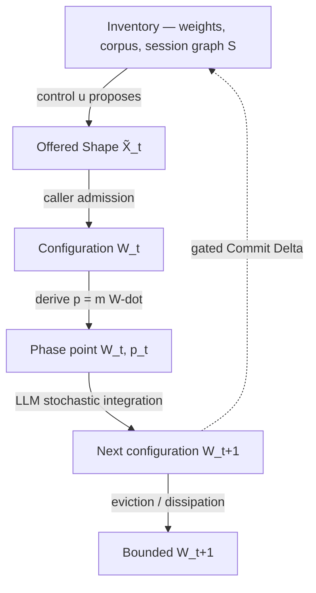

# Analytical Mechanics of Short-Term Memory for Large Language Models

**Szu-Wei Chou**

**2026-09-03** (results §10 updated 2026-09-04; §13 W-only Markov 2026-09-05; ShapeWalk vs RAG bake-off 2026-09-06; Embedding RAG arm 2026-09-06)

> **Header note.** This is a research note accompanying MemNet (https://github.com/chouswei/MemNet). It is analysis. It is not a MemNet SemVer claim and changes no MemNet version.

---

## Abstract

Short-term memory in a large language model is not a store. It is a controlled trajectory. The tokens a model can use at turn $t$ come only from the working-set configuration $W_t$: what is actually resident in the context window and the KV cache. Everything else — weights, a corpus, a session graph $S$ — is inventory. This note argues that analytical mechanics is the right fundamental layer for the *mechanism* of short-term memory. $W_t$ is a phase point. The cue is a control $u$. The momentum $p$ is derived, not asserted. Usefulness is a property of the action $\mathcal{A} = \int L\,dt$ along a trajectory, not of a global ranker and not of a dump of $S$. Three roles separate cleanly and must not be collapsed: the LLM is the integrator, steering is the choice of Hamiltonian, force, or constraint, and memory is the manifold plus the phase point. Because the working set is discrete, we use discrete variational mechanics rather than pretending $W$ is smooth. Because eviction destroys information, we use a dissipative port-Hamiltonian form rather than claiming a symplectic flow. Because window length and row caps are inequalities, we use KKT multipliers, which turns a modelling nuisance into a diagnostic: the multiplier on a cap is strictly positive exactly when that cap is biting. Because the cue is a control, the natural setting is Pontryagin's maximum principle, in which $p$ is the costate and "the experimenter picks the next cue" is the maximisation step. The strongest result is a symmetry. Hidden identifiers are not observable and identity-by-name is not identity, so the offered Shape must be invariant under renaming. That is a gauge invariance. The physical working set is the class in the quotient $\mathcal{W}/G$; a hid-dependent trajectory is a gauge anomaly. A continuous naming chart is used later only as a pedagogical surrogate, not as the derivation of a Noether-I charge. Three predictions are stated with protocols that can fail. On a synthetic stratum they *held*; Prediction 3 failed on stock `memnet-llm` 0.19.3 (hid-ranking of `pin_map` order), then passed after MemNet PR #147. A human-reviewed P1 stratum ($n=200$) passed on gold-evidence presence; Sage closed the author-blind review of those graphs (**ACCEPT after regen**). The LLM-answer quality stratum on the same graphs (full-gold KEY-extraction; OpenRouter `openai/gpt-4o-mini` at $T=0$) also passed, as did a harder evidence-versus-noise discrimination task on that stack. The P3 generation half at $T=0$ closed as a split on $0.19.3$, then both RAW and CANONICAL PASS on `memnet-llm` $0.19.4$. The $T>0$ CANONICAL generation band on that same stack also closed (OpenRouter `openai/gpt-4o-mini`, $T=0.8$, $N_{\mathrm{SAMPLES\_DIST}}=5$, $\mathrm{DIST\_MATCH\_BAND}=0.05$: mean and min exact-match rate $1.0$ on $120$ pairs). P1 $T>0$ closed on the harder evidence-versus-noise band (OpenRouter `openai/gpt-4o-mini`, $T=0.8$, $n_{\mathrm{seeds}}=20$, $n=160$ equal-quality, $95\%$ CI excludes $0$). KEY-extraction $T>0$ was not run. That is not a MemNet SemVer cut; nickname-off-wire is a separate product PR. Hilbert-space formalism is optional later, as a quantisation of this mechanics. It is never the store.

---

## Non-doctrine block

This thesis is analysis. It is not MemNet product doctrine. It changes no MemNet version — not a, not b, not c. Nine specific consequences, stated so they cannot be quietly dropped:

1. **Phase-space equivalence in research does not license a third operator.** It does not license a `rag_query` on the wire. Operator count stays 2: Recall and Commit.
2. $p$ is an analysis quantity. It is never a node property and is never emitted by `pin_map`. Emitting it would break identity-is-the-element and no-store-key.
3. $H$ is not a MemNet verb and not a scheduler. It describes why the agent picks a cue. It does not run anything.
4. **The manifold is implicit and is never emitted.** Do not materialise it, do not precompute it, and do not dump $S$ in order to "see" it.
5. **Multipliers are for analysis.** Engine caps stay hard rejects. A soft, buyable row cap $M$ is goldfish death.
6. $\mathcal{A}$ is an analysis integral over the agent's turns, not engine-retained state. There is no cross-turn trajectory store. That is exactly the stuffed-map failure that dropping prior pin maps exists to prevent.
7. **No engine-emitted coverage, $d$, $\lambda$, or $m$.** Schematic terms in $L_d$ are analysis. They are not `pin_map` fields. The ban is the same as for $p$.
8. **An experimental snapshot is not a dump-$S$ API.** Serialising observable material for a RAG bench is a protocol step. It is not a product dump of $S$ and not `rag_query`.
9. **No learned ranker inside Recall.** Approximating $\arg\max_u H_c$ is experimenter or harness work. It is not a MemNet verb and not a silent merge into RelativeSeed. RelativeSeed still never absorbs. The §13 inspectability lock restates this operationally.

---

## 1 Introduction: the goldfish generate

The next generate is a goldfish. At turn $t$ the model emits tokens conditioned on one thing: the working-set configuration $W_t$, meaning the token and KV state actually resident in the context window. Weights are frozen inventory. A vector index is inventory. A session graph $S$ is inventory. None of it participates in the forward pass unless it has been loaded into $W_t$ first.

This is not a limitation to be argued away. It is the boundary condition that makes the problem well posed. It also kills the most common non-answer, which is to make the store bigger. A larger store does not change the goldfish. Dumping a long-term store into the window is not a mechanism; it is a resource decision that happens to have a mechanism-shaped hole where the mechanism should be. Position effects make this concrete: model performance depends on *where* in a long context the relevant evidence sits, not merely on whether it is present [11]. Presence is not usefulness.

So the question is not "how much can we store" but "which slice is loaded, and at what cost". That question has a shape. It is a state, a control, a cost, and constraints. That is analytical mechanics.

**The claim.** Analytical mechanics is the right fundamental layer for the mechanism of short-term memory in large language models. Configuration, velocity, derived momentum, a Lagrangian, a Hamiltonian, constraints with multipliers, and a variational principle over turns are sufficient to state what short-term memory *is* and to make predictions about it that can fail. Hilbert-space and quantum formalism is optional and later — a quantisation of this mechanics, taken up in §11. It is never the store.

**One caveat, stated early.** The LLM is a stochastic map. At temperature $T > 0$ the update from $W_t$ to $W_{t+1}$ is sampled, not determined, so the integrator is a Langevin-type stochastic integrator and not a symplectic one; deterministic statements below are statements about the drift, and every measurement protocol in §10 must either fix the temperature or average over seeds. The §13 stochasticity seam lock is the rest of that split: drift versus path measure; Onsager–Machlup is a candidate rate functional for the continuous surrogate, not a theorem for discrete token or admission noise.

**Turn index.** Throughout, $t$ is a **turn index**, not wall-clock time. $t \to t+1$ is one agent turn. Wall-clock latency is a real engineering quantity and is not this variable.

## 2 Related work

**Analytical mechanics.** The standard treatments are Goldstein, Poole and Safko [1] and Landau and Lifshitz [2]. We use them for the ordinary machinery: generalised coordinates, the Legendre transform, canonical transformations, and constraint classification.

**Discrete variational mechanics.** The working set is discrete, so the correct reference frame is discrete mechanics rather than a smoothed analogy. Marsden and West [3] give discrete Lagrangians, discrete Euler-Lagrange equations, a discrete Noether theorem, and natural treatments of forces, dissipation and constraints. This is the load-bearing citation for §3.

**Dissipative and open systems.** A memory that forgets is not conservative. Port-Hamiltonian systems theory [4] supplies the resistive structure and the dissipation inequality that eviction needs.

**Optimal control.** Cue-as-control plus an action functional is optimal control, not bare classical mechanics. Pontryagin's maximum principle [5] gives the costate interpretation of $p$ and the control Hamiltonian. Inequality constraints are handled by the Karush-Kuhn-Tucker conditions [6][7], with the standard modern presentation and the shadow-price reading of multipliers in Boyd and Vandenberghe [8].

**Symmetry.** Noether [9] is the source for symmetry implies conservation. The case that applies here is a finite group $G$ acting globally: physical Shape lives in the quotient $\mathcal{W}/G$ (orbit equivalence). The second theorem's local gauge invariance is only what an optional continuous naming chart would look like; it is not the existing lock (§8).

**Geometric and quantum-inspired information retrieval.** There is a real literature that puts retrieval in Hilbert space: van Rijsbergen [10], the survey by Uprety, Gkoumas and Song [12], and Piwowarski, Frommholz, Lalmas and van Rijsbergen [13]. Operator representations of graph nodes exist too [14]. This work is relevant to §11 and is explicitly *not* the foundation used here. Quantum walks [17][18] appear only in §11. Quantum steering [19] appears only as a contrast: the steering in this paper is classical control, not the EPR-type phenomenon.

**Context loading and eviction.** Retrieval-augmented generation [16] is the canonical load operator. KV eviction has a growing literature; H2O [20] evicts by accumulated attention score, and SnapKV [21] selects prompt KV positions using an observation window at the end of the prompt. Position sensitivity in long contexts is documented by Liu et al. [11]. In the language of this paper, all of these are *controls on the same phase space*.

**Informal.** Karpathy's model-as-CPU / context-as-RAM analogy [15] is a useful piece of framing and is cited as informal commentary, not as a result. It gets the inventory-versus-resident distinction right and stops there; it has no dynamics, no cost functional, and no symmetry.

## 3 Analytical mechanics as the fundamental

### 3.1 The variational object

Let $\mathcal{W}$ denote the configuration manifold of admissible working sets. A trajectory is a sequence $W_0, W_1, \ldots, W_N$. In a continuous surrogate one writes

$$
\mathcal{A}[W,u] = \int_{0}^{N} L(W,\dot{W},u,t)\,dt.\qquad (1)
$$

The action is always $\mathcal{A}$, never $S$. The symbol $S$ is locked to the persistent session graph. A useful elementary Lagrangian is

$$
L(W,\dot{W},u,t)=\frac{1}{2}m\|\dot{W}\|^2-V(W;u,t)-C(W,u,t).\qquad (2)
$$

The kinetic term is not decoration. It defines persistence. The parameter $m$ is pin stickiness: large $m$ makes rapid working-set changes costly. The cue $u$ enters a time-dependent potential or a constraint. It is a control, not a coordinate. $C$ prices token load, unsupported material, redundancy, or task error.

Now derive momentum rather than naming one by intuition:

$$
p = \frac{\partial L}{\partial \dot{W}} = m\dot{W}.\qquad (3)
$$

Thus hold and inertia are represented by $m$. Momentum is the consequence $m\dot{W}$. It is not defined as "how hard a pin resists eviction". Such a verbal definition would assert the answer without giving a Lagrangian and would make $p$ a product field. Both are category errors.

Where the Legendre transform is regular, the Hamiltonian is

$$
H(W,p,u,t)=p\cdot\dot{W}-L=\frac{\|p\|^2}{2m}+V(W;u,t)+C(W,u,t).\qquad (4)
$$

This $H$ is an analysis function. It is not a MemNet verb and not a scheduler. It explains the selected deflection of $W$; it does not perform Recall or Commit.

**Peak\_L firewall.** MemNet has a product selector named `Peak_L`, a last-resort seed selector under RelativeSeed, not the default. In this paper $L$ is the Lagrangian. Product `Peak_L` is **not** $\arg\max L$.

### 3.2 No smooth-manifold fudge

A token is admitted or it is not. A graph row is returned or it is not. The native $W$ is discrete, while ordinary Hamilton's principle assumes a smooth manifold. Pretending otherwise would make every later equation cosmetic.

Use a discrete Lagrangian $L_d(W_k,W_{k+1};u_k)$, interpreted as an approximation to the action over one turn. The discrete action is

$$
\mathcal{A}_d = \sum_{k=0}^{N-1} L_d(W_k,W_{k+1};u_k).\qquad (5)
$$

Varying interior configurations with endpoints fixed gives the discrete Euler-Lagrange equation [3]:

$$
D_2 L_d(W_{k-1},W_k;u_{k-1})+D_1 L_d(W_k,W_{k+1};u_k)+F^-_k+F^+_k=0.\qquad (6)
$$

Here $D_1 L_d$ means the partial derivative of $L_d$ with respect to its *first* slot (the earlier configuration), and $D_2 L_d$ with respect to its *second* slot (the later configuration). They are not new operators; they are ordinary gradients with the two arguments of $L_d(W_k,W_{k+1})$ labelled. The $F_k^\pm$ terms are discrete external forces: steering, tool output, or a commit kick. Discrete Noether theory gives conservation laws for symmetries of $L_d$. Forced and constrained versions remain available. Dissipation can also be included. On the hard window, eviction is carried as a discrete dissipative force in that forced/dissipative discrete EL sense (schematic until a discrete Dirac / discrete port-Hamiltonian step exists; any such writing must meet the §13 update-lock requirements); continuous resistive $R$ in (10) remains the continuous forgetting account, not a second competing discrete eviction channel. This is why discrete variational mechanics is not merely a patch; it is the native formulation. The per-turn update is (6). Continuous port-Hamiltonian in §3.3 accounts for forgetting; it is not a competing discrete step (seam lock in §13).

There is an alternative when gradients are needed. Relax membership into continuous attention mass $a_i \ge 0$ on a simplex,

$$
\sum_i a_i = 1,\qquad (7)
$$

and define $W$ by its attention-density vector. The vertices recover hard admission. This relaxation can estimate gradients or solve an optimal control problem, but an implementation must round back to a discrete working set. The relaxed system is an instrument, not an excuse to claim the actual window is smooth.

### 3.3 Forgetting makes the system open

Pure Hamiltonian flow is symplectic and volume-preserving. Eviction is neither. It destroys recoverable state from the active working set. Therefore "$H$ generates the next step" plus "caps evict" is quietly inconsistent unless loss is modelled.

One option is a Rayleigh dissipation function,

$$
\mathcal{R}(\dot{W})=\frac{1}{2}\gamma\|\dot{W}\|^2,\qquad (8)
$$

which modifies the Euler-Lagrange equation to

$$
\frac{d}{dt}\frac{\partial L}{\partial\dot{W}}-\frac{\partial L}{\partial W}+\frac{\partial\mathcal{R}}{\partial\dot{W}}=F_u.\qquad (9)
$$

The better systems account is port-Hamiltonian [4]:

$$
\begin{bmatrix}\dot{W}\\ \dot{p}\end{bmatrix}=(J-R)\nabla H+Gu,\qquad J^{\top}=-J,\qquad R=R^{\top}\succeq 0.\qquad (10)
$$

Then

$$
\dot{H}=-\nabla H^{\top} R\nabla H+y^{\top}u\le y^{\top}u.\qquad (11)
$$

Read the symbols once. $\nabla H$ is the gradient of $H$ in the $(W,p)$ coordinates. $G$ is the input matrix that maps the control vector $u$ into that same phase-space; $Gu$ is the steered force. The superscript $\top$ is transpose: $J^{\top}=-J$ says $J$ is skew-symmetric; $y^{\top}u$ is the ordinary scalar product of the co-port $y$ with the control $u$. The relation $R\succeq 0$ means $R$ is symmetric positive semidefinite — a matrix that can only dissipate, never create, energy. The inequality $\le$ in (11) is the dissipation inequality: stored energy cannot rise faster than the power injected through the port.

The skew structure $J$ accounts for conservative interchange. The resistive structure $R$ accounts for eviction, summarisation loss, and lossy KV compression. The port $(u,y)$ accounts for energy supplied by steering. This is the precise repair for the strongest physics objection to the model: a forgetting memory is an open dissipative system, not a closed Hamiltonian one. Equations (10)–(11) are that continuous dissipative account. The discrete turn update remains (6) (§13).

## 4 Dictionary and naming

| Symbol or term | Meaning in this paper |
|---|---|
| $S$ | The persistent session graph: inventory, not the action and not the working set. |
| $\mathcal{A}=\int L\,dt$ | The action over agent turns. It is an analysis integral, not retained engine state. |
| $W_t$ | The LLM-side working-set configuration actually in the context window / KV cache at turn $t$. This is the phase point's configuration component. |
| $\dot{W}$ | Working-set change per turn; in the native discrete model, a finite difference or transition descriptor. |
| $\tilde{X}_t$ | The bounded MemNet `pin_map` artifact: the offered Shape that may populate or steer $W_t$. |
| $u$ | The cue as a control: a time-dependent potential, force input, or constraint pinning a submanifold. Never a coordinate. |
| $q$ | Reserved for the MemNet product cue, represented by codebook tokens. Product $q$ maps to analysis control $u$, once at the product boundary. |
| $p$ | Conjugate momentum, derived by $p=\partial L/\partial\dot{W}$. With the kinetic term above, $p=m\dot{W}$. |
| $L(W,\dot{W})$ | The Lagrangian: persistence cost minus controlled potential and task costs, with controls made explicit when needed. |
| $H(W,p)$ | The Legendre transform/control Hamiltonian, with $u$ explicit when needed. Not a product verb. |
| $\Delta$ | The gated Commit. It is an impulse that can change inventory $S$, not the session graph itself. |
| $t$ | Turn index, not wall clock. |
| store | The manifold of configurations on which $W$ can live, represented by inventory such as weights, a cabinet, a corpus, or session graph $S$. It is not the point $W$. |

**Uncommon operators, once.** $\setminus$ is set difference. $\mapsto$ means "is rewritten as." $\arg\max$ is the set of maximisers. $\nabla$ is gradient; $(\cdot)^{\top}$ is transpose; $R\succeq 0$ means positive semidefinite. $D_1,D_2$ are partials in the first and second slots of a two-argument discrete Lagrangian. A hat ($\widehat{\cdot}$) marks an estimator. $\chi_{\mathrm{invalid}}$ is a $0$/$+\infty$ barrier. These are standard analysis marks; none is a MemNet wire verb.

There are two levels in the word *store*. Concrete cabinets contain elements. Analytically, their addressable possibilities induce the manifold $\mathcal{W}$. The store is therefore the manifold on which a phase point may be selected, not the selected point itself. Memgraph and Neo4j can implement a cabinet. Neither is a theory of memory.

A **canonical transformation** changes coordinates while preserving the symplectic form. Here it means changing how the same inventory is addressed: for example, replacing one cue basis with another invertible cue basis while leaving observable load trajectories unchanged. A new cue basis is not a new memory if the physics is equivalent.

A **holonomic constraint** depends only on the current configuration, $g(W_t)=0$. "Keep the system instruction resident" can be modelled this way. A **path-dependent constraint** depends on history or reachability. Leftover identifiers do not teleport: one can pin only what one can cue along an admissible path. A claimed pin that cannot be reached by the current cue is not a point on the admissible submanifold.

The most important dictionary distinction is operational. $W_t$ is LLM-side. $\tilde{X}_t$ is the offered Shape. The relation $\tilde{X}_t\subseteq W_t$ holds only if the caller admits the whole Shape. Steering proposes $\tilde{X}$; the caller's admission decides $W$; eviction then acts on $W$. These are three distinct places control enters. Collapsing the first two hides one.

[^W-not-Q]: $W$ is not called $Q$ because $Q$ is already taken in MemNet for the `RelativeSeed` seed set; $\lvert Q\rvert>1$ is `CueConflict`.

## 5 The role of the LLM

The LLM is the integrator. It runs the equations of motion under whatever $H$ and constraints are set. It does not pick the Lagrangian. It does not hold, measure, or commit $S$. In an agent loop it may also pick the next cue — that is the experimenter, still not the memory.

This role statement is intentionally strict. A forward pass integrates one controlled step. Sampling supplies stochastic forcing. The prompt constructor, retriever, and KV policy establish the force and boundary conditions. The model then maps resident state to a distribution over outputs. Calling the model "the memory" confuses the transition rule with the state being transitioned.

The integrator may produce text that proposes a cue for the next turn. At that moment the same software component occupies a second *role*: experimenter. The distinction is causal, not organisational. The experimenter selects $u_t$; the integrator realises the stochastic transition conditional on $u_t$. Logging them separately is enough to test the distinction.

## 6 Steering as control

Steering is choosing $H$, a force, or a constraint that deflects $W$. ShapeWalk, RAG retrieval, a ranker, and KV eviction are different controls on the same phase space. Steering is not the generate and not the store. Quantum steering is a different technical concept [19]; none of its nonlocality is invoked here.

### 6.1 Optimal control, not bare mechanics

Let the controlled state obey

$$
\dot{W} = f(W,u,t)\qquad (12)
$$

or its discrete counterpart $W_{t+1}=F(W_t,u_t,\xi_t)$, where $\xi_t$ is sampling noise (the stochastic draw of the LLM). At $T>0$ that controlled process induces a path measure $\mu$ on trajectories, not a single curve; see the §13 stochasticity seam lock. Let the objective be

$$
J[u] = \Phi(W_N) + \int_0^N \ell(W,u,t)\,dt.\qquad (13)
$$

Here $\Phi(W_N)$ is a terminal cost on the final working set, and $\ell(W,u,t)$ is the running cost per turn (token mass, task error, redundancy). Do not confuse $\ell$ with the Lagrangian $L$: $\ell$ is the optimal-control running cost inside $J[u]$; $L$ is the mechanical Lagrangian of §3. Neither $\ell$ nor $\Phi$ is a MemNet verb; both are analysis scalars chosen by the experimenter.

Pontryagin's control Hamiltonian is

$$
H_c(W,p,u,t)=p\cdot f(W,u,t)-\ell(W,u,t).\qquad (14)
$$

The necessary conditions are

$$
\dot{W}=\frac{\partial H_c}{\partial p},\qquad \dot{p}=-\frac{\partial H_c}{\partial W},\qquad u_t\in\arg\max_{u\in U}H_c(W_t,p_t,u,t).\qquad (15)
$$

The first two lines are the usual Hamilton equations for state and costate. The third uses $\arg\max$: $u_t$ is any control in the allowed set $U$ that *maximises* $H_c$ at the current $(W_t,p_t)$. If several maximisers exist, any one may be chosen; the set notation $\in\arg\max$ records that. That maximisation step *is* cue selection.

Here $p$ in (14)–(15) is the adjoint $p_{\mathrm{adj}}$ by definition of $H_c$. Mechanical momentum $p_{\mathrm{mech}}=\partial L/\partial\dot{W}=m\dot{W}$ is (3); the discrete fibre derivatives of $L_d$ are (35)–(36). Identification $p_{\mathrm{mech}}\equiv p_{\mathrm{adj}}$ is conditional under the §13 Legendre seam lock. In this section's display prose write $p_{\mathrm{adj}}$ or $p_{\mathrm{mech}}$ explicitly. Reserve a bare $p$ for sentences that invoke that lock, and for (14)–(15) where $p$ is already the costate. Do not collapse the seam for a skimmer. This is not permission to invent a `momentum` field. The maximum principle *is* the sentence "the experimenter picks the next cue." The LLM does not choose the cost functional. It integrates the next step after the experimenter or agent harness selects $u$.

### 6.2 Inequality caps and KKT diagnostics

Window length, hop radius, row cap $M$, and load-rate caps are inequalities. They are not plain equality constraints with ordinary Lagrange multipliers. Let

$$
g_M(W)=\lvert W\rvert-M\le 0.\qquad (16)
$$

The augmented cost uses a KKT multiplier $\lambda_M\ge0$. Necessary conditions include primal feasibility, dual feasibility, stationarity, and complementary slackness [6][7][8]:

$$
\lambda_M g_M(W)=0.\qquad (17)
$$

Therefore

$$
\lambda_M>0 \implies \lvert W\rvert=M.\qquad (18)
$$

Under regularity and an active optimum, a positive shadow price occurs precisely when relaxing the cap would improve the objective. This yields a measurable result: $\lambda_M>0$ exactly when the goldfish row cap is biting. The same applies to window length, hop radius, and rate caps. Estimate $\lambda_M$ by finite differences of optimal task loss around $M$, not by softening the engine reject. The engine cap remains hard.

### 6.3 Three control surfaces

Control enters at three places:

1. **Proposal:** a retrieval or walk offers $\tilde{X}_t$.
2. **Admission:** the caller constructs actual $W_t$ from the proposal, instructions, dialogue, and tool results.
3. **Eviction:** a KV policy removes elements or attention mass from $W_t$ after admission.

A global ranker controls proposal. It does not determine admission and cannot know the final eviction trajectory by itself. This is why a single relevance score cannot be the mechanism of STM. A ranker that only proposes is allowed; collapsing the three surfaces, or skipping their logs, fails the §13 inspectability lock.

**RAG firewall.** RAG is a legitimate object of study as a load operator. It is still not a sanctioned MemNet operator. Phase-space comparison does not add `rag_query` to the wire.

## 7 Memory as manifold and phase point

Memory is manifold plus phase point. The store — weights, cabinet, session graph $S$, corpus — is inventory. STM is $(W,p)$. Usefulness is a trajectory of $\mathcal{A}$, not a dump. The pair $(W,p)$ is the intended Markov state of the *active* process, conditional on fixed inventory over the tested horizon; that claim is fail-able under the §13 Markov lock.

The configuration manifold collects admissible working sets. Its topology says which configurations can be reached from which others under legal controls. The phase point adds the derived tendency $p$, so two identical windows need not represent the same memory state if one is being held and one is being rapidly displaced. The distinction is analytical: no engine emits $p$.

This definition answers a practical question that static retrieval metrics evade. Suppose two systems expose the same evidence at turn 5. System A loaded a bounded neighbourhood at turns 2–5 and preserved task-relevant pins. System B repeatedly dumped large ranked lists and evicted the useful evidence twice. Their endpoint $W_5$ may match, but their action costs differ. STM quality is path-sensitive.

A phase-space diagram makes the separation explicit:

The diagram has no arrow from inventory directly to generation. Every usable item crosses the proposal and admission boundaries. Commit $\Delta$ points back to inventory because it changes $S$, not because $S$ is the action.

### 7.1 Locality and reachability

A store induces many possible coordinates. Only a small neighbourhood is reachable under a bounded cue. This makes graph topology mechanically relevant without turning the graph into the state. A $k$-hop control restricts admissible transitions; it does not claim the whole graph is resident.

Path dependence matters for stale ids. If an identifier remains in a caller but is no longer nameable from the current cue basis, it cannot be treated as an instantaneous holonomic pin. It requires a path through admissible cues or it is unavailable. "Leftover ids do not teleport" is thus a reachability condition.

### 7.2 Framework honesty

Analytical mechanics supplies the dynamics. An earlier quantum-measurement pass supplied a different discipline: no-cloning as "hand the session id, do not dump $S$," and `CueConflict` as "do not fake collapse." Analytical mechanics does not give those constraints for free. They remain interface and measurement commitments. This paper has not swapped frameworks and silently retained their conclusions; it states which framework contributes what.

## 8 Noether: rename invariance as gauge symmetry

This is the main result.

### 8.1 The symmetry already exists

A hidden identifier `hid` is not observable. Identity-by-name is not identity. Rename every hidden storage identifier by a bijection $\rho$, preserving incidence, observable payloads, and codebook-token relations. A correct `pin_map` output cannot change except for the corresponding unobservable relabelling. Formally, if $G$ is the group of such renamings and $g\in G$, then the discrete Lagrangian must satisfy

$$
L_d(gW_t,gW_{t+1};u_t)=L_d(W_t,W_{t+1};u_t).\qquad (19)
$$

The measurable Shape is an equivalence class $[\tilde{X}_t]$ under $G$, not a bag of cabinet keys. This is gauge invariance: multiple internal descriptions denote one physical working-set trajectory.

For a finite permutation group, invariance gives exact orbit equivalence rather than a differential Noether charge. That orbit equivalence on the quotient $\mathcal{W}/G$ is the theorem. That split is the seam lock in §13. What follows is a continuous pedagogical surrogate, not a derivation from the existing MemNet lock. The lock is a global bijection $\rho$ on hidden ids, applied once to the cabinet. Local turn-dependent renaming is a strictly larger group. Embed renaming in a continuous redundant naming chart only to show what a Noether-II constraint *would* look like. Let $\theta^a_t$ be coordinates that choose an internal naming gauge while observables $x_t$ encode incidence and payload. Write

$$
W_t=(x_t,\theta_t),\qquad (20)
$$

and require local gauge invariance under arbitrary turn-dependent shifts

$$
\theta_t^a \mapsto \theta_t^a + \epsilon_t^a.\qquad (21)
$$

The arrow $\mapsto$ means "is sent to": each naming coordinate $\theta_t^a$ may be shifted by an arbitrary $\epsilon_t^a$ at that turn. It is a rewrite rule for the chart, not a dynamical flow.

Because names are unobservable, the action cannot depend on $\theta^a$ or its velocity. The conjugate naming momentum is therefore

$$
\pi_a = \frac{\partial L}{\partial \dot\theta^a}=0.\qquad (22)
$$

Its evolution is

$$
\dot\pi_a = \frac{\partial L}{\partial \theta^a}=0.\qquad (23)
$$

In the surrogate, the vanishing gauge charge $\pi_a\equiv0$ is a constraint: no physical momentum flows in the hidden-name direction. It is a property of the continuous chart, not a conserved payload of the product. Ordinary global symmetries yield a possibly nonzero conserved charge. A local gauge symmetry yields a Noether identity and a constraint. The product lock is global and discrete; the local continuous story is pedagogy. Calling some arbitrary hash count "the conserved quantity" would be wrong. The rigorous result is that physical trajectories lie in the quotient $\mathcal{W}/G$.

### 8.2 Observable consequence

Let a load cost be

$$
C_{\mathrm{load}}(\tilde{X}_t,W_t).\qquad (24)
$$

Gauge invariance requires

$$
C_{\mathrm{load}}(g\tilde{X}_t,gW_t)=C_{\mathrm{load}}(\tilde{X}_t,W_t).\qquad (25)
$$

Then action, cap multipliers, and task metrics are all functions on the quotient space. Two isomorphic session graphs differing only in hidden names must produce the same distribution of admitted Shapes, the same estimated action, and the same task score, up to sampling error.

### 8.3 What breaks when symmetry breaks

If `hid` leaks into ranking, ordering, persistence, or the returned Shape, the potential becomes $V(W;u,\theta)$. Then

$$
\dot\pi_a=\frac{\partial L}{\partial\theta^a}\ne0.\qquad (26)
$$

The naming gauge exerts a fictitious force. Two relabelled but otherwise identical stores can follow different trajectories. The measured action becomes cabinet-dependent. Cache behaviour can change after a database migration that preserves all observable content. Worse, an emitted hidden key acquires apparent identity and can be replayed as if it were the element. That violates identity-is-the-element and no-store-key.

This gives a direct test. Generate isomorphic copies of a session graph under random hidden-id permutations. Fix cue codebook tokens, admission policy, model, and RNG seed. Canonicalise *labels*, not sequence: admission order in the window is physical [11]. If a hid-sort changes row order and therefore $W$, that is a gauge anomaly, not noise to be washed out. Any systematic difference is a gauge anomaly. The quotient has become an executable invariant test.

## 9 Instantiations: one phase space, different controls

The instantiations below repeat a crucial distinction because implementations tend to erase it: $W_t$ is LLM-side; $\tilde{X}_t$ is the offered Shape; $\tilde{X}_t\subseteq W_t$ only if the caller admits the whole Shape. Steering proposes $\tilde{X}$, caller admission decides $W$, and eviction then acts on $W$. These are three distinct control sites. Collapsing proposal and admission hides one.

### 9.1 MemNet ShapeWalk

This is a worked example using package `memnet-llm` 0.19.3. It is not the only physics and it is not a MemNet 1.0 claim.

Let the product cue $q_t$ be a finite sequence of codebook tokens. At the analysis boundary, map product $q_t$ to control $u_t$. Relative seed selection identifies a legal seed relative to the existing session. A bounded ShapeWalk explores at most $k$ hops and returns at most `LIMIT M` rows. The resulting bounded `pin_map` artifact is $\tilde{X}_t$.

A schematic discrete Lagrangian is

$$
L_d(W_t,W_{t+1};u_t)=\frac{m}{2}\,d(W_t,W_{t+1})^2-\alpha\,\mathrm{coverage}(W_{t+1},u_t)+\beta\,\lvert W_{t+1}\setminus W_t\rvert+\chi_{\mathrm{invalid}}.\qquad (27)
$$

Read (27) term by term. $d(W_t,W_{t+1})$ is the §13 ordered-observable edit distance (37) between consecutive working sets, not an unspecified set distance. The stickiness $m$ prices churn through the kinetic term. $\mathrm{coverage}(W_{t+1},u_t)$ is a scalar reward for how well the new set supports the cue — analysis only, never a `pin_map` field. The operator $\setminus$ is set difference: $W_{t+1}\setminus W_t$ is the set of elements newly admitted this turn, and $\lvert W_{t+1}\setminus W_t\rvert$ is their count. The symbol $\chi_{\mathrm{invalid}}$ is an indicator barrier: $0$ on legal transitions and $+\infty$ on hard-invalid ones (cap violations, unreachable pins), so illegal moves are simply not stationary points of $L_d$. The native discrete momentum is the discrete Legendre transform of $L_d$, not returned by the engine.

**Worked turn.** Assume the LLM is answering why a prior deployment failed. At turn 7, product cue $q_7$ contains codebook tokens for `deployment`, `rollback`, and a relative-session marker. The experimenter maps this to $u_7$. ShapeWalk starts from the legal RelativeSeed, walks up to $k=2$, and offers 18 rows under hard `LIMIT M=24`; this is $\tilde{X}_7$. The caller admits the 12 rows whose observable payload fits alongside system text and recent dialogue, so $\tilde{X}_7\nsubseteq W_7$ as an entire Shape. KV policy then removes two low-value old dialogue spans from $W_7$. The model integrates the resulting state and explains the rollback. If the output warrants durable change, gated Commit $\Delta_7$ writes a new observable relation to $S$. Commit is an impulse that changes the manifold's inventory for future turns. It is not a third retrieval operator.

The constraints are

$$
\mathrm{hop}(\tilde{X}_7)\le k,\qquad \lvert\tilde{X}_7\rvert\le M,\qquad \mathrm{rate}(W_7,W_8)\le r.\qquad (28)
$$

Plain language: $\mathrm{hop}(\tilde{X})$ is the farthest graph distance from the seed still present in the offered Shape; $\lvert\tilde{X}\rvert$ is the row count; $\mathrm{rate}(W_t,W_{t+1})$ is how fast the working set is allowed to change (for example $\lvert W_{t+1}\setminus W_t\rvert$). All three are $\le$ inequalities — hard caps, not soft targets.

Their KKT multipliers estimate which cap is active in the *optimal-control account*. Product behaviour remains hard reject. If the row-cap multiplier becomes positive and task loss rises, the diagnostic says the offered Shape is pressing against $M$. It does not say to make $M$ buyable.

Rename invariance is immediate: permuting all hidden ids while preserving observable relations must leave the canonicalised 18-row Shape unchanged. This is the §8 gauge test in product clothing.

### 9.2 RAG retrieval

RAG [16] is one load operator from a corpus into the window. A retriever maps query control $u_t$ to passages, giving an offered set $\tilde{X}_t^{\mathrm{RAG}}$. A prompt assembler admits some or all passages into $W_t$. The model then integrates. A large top-$K$ is not a larger memory; it is a stronger and usually more dissipative load impulse.

The relevant cost is not only retrieval relevance. It includes token mass, duplication, displacement of resident pins, and positional degradation:

$$
C_{\mathrm{RAG}}=c_{\mathrm{tok}}\lvert\tilde{X}\rvert+c_{\mathrm{dup}}D(\tilde{X})+c_{\mathrm{evict}}E(W_{t-1},W_t)+c_{\mathrm{task}}\ell_{\mathrm{task}}.\qquad (29)
$$

Each $c_{\cdot}$ is a nonnegative weight fixed by the experimenter. $\lvert\tilde{X}\rvert$ prices token mass; $D(\tilde{X})$ prices duplication inside the offer; $E(W_{t-1},W_t)$ prices how much resident material was displaced; $\ell_{\mathrm{task}}$ is the task loss (for example $1$ minus answer quality). None of these scalars is emitted by the engine.

The "lost in the middle" result [11] implies that equal evidence with equal inclusion can induce different task costs under different positions. Therefore global rank alone cannot determine $W$'s usefulness.

RAG is a legitimate experimental control. The RAG firewall still holds: it is not a sanctioned MemNet operator, and the phase-space account licenses no `rag_query` verb.

### 9.3 KV eviction: H2O, SnapKV, and cousins

KV eviction controls the third surface. H2O retains a balance of recent tokens and accumulated-attention heavy hitters [20]. SnapKV uses an observation window to select clustered prompt positions per attention head [21]. Both act by throwing mass out of $W$ when capacity binds.

Their action is dissipative. If a selected KV entry is gone, ordinary Hamiltonian inversion cannot recover it. In the port-Hamiltonian form, each policy changes the resistive structure $R$. A policy that removes task-irrelevant mass has low task-weighted dissipation; one that removes a critical pin has high task-weighted dissipation even if byte counts match. That language is licensed only under the §13 circularity lock: preregister weights / critical-pin definitions on a development set and evaluate on held-out tasks.

This suggests a common benchmark across ShapeWalk, RAG, H2O, and SnapKV. Hold the model and task fixed. Instrument proposal, admission, and eviction separately. Measure transition distance, resident token mass, task loss, and estimated cap multipliers. They are then comparable controls on one phase space rather than unrelated product categories.

## 10 Falsifiable predictions

A dictionary can always be made to fit after the fact. A mechanism must rule out outcomes. The following predictions can fail.

### 10.1 Prediction 1: bounded local loading costs less action than a dump

**Claim.** For tasks whose required evidence lies within a bounded $k$-hop session neighbourhood, the same information loaded by bounded ShapeWalk will achieve equal task performance at lower measured action than a RAG-style dump of the available session material.

Define an operational discrete action estimator before seeing outcomes:

$$
\widehat{\mathcal{A}}_d=\sum_t\bigl[a\,d(W_t,W_{t+1})^2+b\,\mathrm{tokens\_admitted}_t+c\,\mathrm{critical\_evictions}_t+d\,\ell_{\mathrm{task},t}\bigr],\qquad (30)
$$

The hat on $\widehat{\mathcal{A}}_d$ marks an *estimator*: an operational stand-in for the true action, not the action itself. The coefficients $a,b,c,d$ are nonnegative and must be preregistered on a development set before the held-out comparison. Those harnesses may also use a preregistered stand-in for $d$ itself (as the P1 strata did with $d(\emptyset,W):=\lvert W\rvert$); that is a measurement-model choice, not a second definition of $d$ — conceptual $d$ remains the §13 ordered-observable metric (37). $\mathrm{tokens\_admitted}$ counts newly loaded token mass; $\mathrm{critical\_evictions}$ counts removals of task-relevant pins and inherits the §13 preregistration discipline (freeze the checklist before held-out $\widehat{\mathcal{A}}$); $\ell_{\mathrm{task}}$ is task loss. This is not claimed to be a universal Lagrangian. It is a measurement model.

**Protocol.** Build at least 500 synthetic and 200 human-reviewed session graphs. Each task has a known minimal evidence set within $k\le2$ hops of a legal RelativeSeed. Create two load conditions: (A) bounded ShapeWalk with fixed hard $M$, and (B) a semantic RAG operator allowed to retrieve from a serialised snapshot of the same observable material. That snapshot is a bench fixture. It is not a product dump of $S$ and not `rag_query`. Match model, prompt instructions, and total output budget. Compare at equal task quality; do not require matched final evidence coverage. A coverage-match plus a token-mass term in $\widehat{\mathcal{A}}_d$ would make the dump lose by construction. Log offered $\tilde{X}_t$, caller admissions, final $W_t$, KV evictions, answer score, and all random seeds. Run deterministic decoding and a temperature condition with at least 20 seeds. Compare $\widehat{\mathcal{A}}_d$ at matched answer quality using paired bootstrap confidence intervals.

**Failure condition.** If RAG dumps have equal or lower action at equal quality across the prespecified local-task stratum, the predicted advantage is false. If the result appears only after changing coefficients, it is also false for the preregistered estimator. A mixed result would narrow the claim to particular graph topologies rather than rescue it universally.

**Result (synthetic stratum, 2026-09-04).** PASS as a *structural* claim only. MemNet @ `eff05dc8` (post PR #147). $n=500$ sessions. Score here means **equal gold-evidence presence** ($\lvert\mathrm{gold}\cap W\rvert/\lvert\mathrm{gold}\rvert$), not LLM answer quality — both conditions scored $1.0$ on all $500$. Coefficients locked before outcomes: $a=1$, $b=1$, $c=0$, $d=10$, with $d(\emptyset,W)=\lvert W\rvert$ in (30). Mean $\widehat{\mathcal{A}}$ walk $=422$, dump $=2356$, paired $\Delta=1934$; $95\%$ bootstrap CI $[1934,1934]$ excludes $0$. Dump admitted mean $\lvert W\rvert=35$ vs walk $\lvert W\rvert=11$. $\Delta$ was constant across this regular synthetic family. No LLM generate. Do not read this PASS as the full §10.1 claim.

**Result (human-reviewed stratum, 2026-09-04).** PASS on the same coefficient lock (not retuned). $n=200$ graphs, **17** topology families, checklist $200/200$. Reviewer: Sage, author-blind (did not author graphs); stratum sign-off **ACCEPT after regen**. Eight `asymmetric-spoke` graphs were regenerated with a non-gold hop-1 decoy after AUTO_DUMP ($k\le 2$ neighbourhood gold-only). Post-regen gold-presence (`memnet-llm` $0.19.4$, coefficients unchanged): both-perfect $n=170$; mean $\Delta\approx 2930.59$; $95\%$ CI $[2778.71, 3084.10]$ excludes $0$. Walk-imperfect $n=30$ (all cap-binding under $M=12$). Distinct $\Delta$ values remain non-constant (not the synthetic constant-$\Delta$ failure mode). Gold-evidence presence, not LLM answer quality. No LLM generate. Harness: [`experiments/p1-hr/`](../experiments/p1-hr/). Blind record: [`experiments/p1-blind/`](../experiments/p1-blind/).

**Result (author-blind review, 2026-09-04).** Sage reviewed blinded packs: no `expect_*`, no prior reviews, no $\widehat{\mathcal{A}}$ as quality evidence. Objective blind checklist $200/200$ PASS; $100\%$ agreement with original `checklist_pass`. Deep sample $n=34$: initially $33$ OK. Eight `asymmetric-spoke` AUTO_DUMP fails listed, regenerated, Sage re-check **ACCEPT** $8/8$. Stratum sign-off: **ACCEPT after regen** ([`experiments/p1-blind/SAGE_SIGNOFF.md`](../experiments/p1-blind/SAGE_SIGNOFF.md)). The sealed pack map is not shipped.

**Result (LLM-answer quality stratum, 2026-09-04).** PASS. Same $n=200$ p1-hr graphs, same coefficient lock ($a=1$, $b=1$, $c=0$, $d=10$; **not retuned**). `memnet-llm` $0.19.4$. LLM: OpenRouter `openai/gpt-4o-mini`, $T=0$ greedy. Protocol: walk (`pin_map`, $M=12$, $k=2$) versus dump bench fixture. Prompt-only KEY on $\mathrm{gold}\cap W$. **Fixed scorer:** $\mathrm{score\_llm}=\lvert\mathrm{pred}\cap\mathrm{full\_gold\_keys}\rvert/\lvert\mathrm{full\_gold\_keys}\rvert$, where $\mathrm{full\_gold\_keys}$ is *all* `graph.gold_slugs`, **not** $\mathrm{gold}\cap W$. Post-regen merge on touched sessions: both-perfect (both $\mathrm{score\_llm}=1.0$ on full gold) $n=170$; $n_{\mathrm{walk\_imperfect\_llm}}=30$; $n_{\mathrm{dump\_imperfect\_llm}}=0$. Primary matches gold-presence: mean $\Delta\approx 2930.59$, $95\%$ CI $[2778.71, 3084.10]$ excludes $0$. Verdict **PASS**. Verification: session $170$ walk $\mathrm{score\_llm}=0.20$ ($1/5$) versus dump $1.00$. KEY $T>0$ not run (**OPEN**). Harness: [`experiments/p1-llm/`](../experiments/p1-llm/).

**Scorer honesty.** An earlier LLM run scored against $\mathrm{gold}\cap W$ (extraction fidelity) and falsely reported $200/200$ LLM-perfect. That run is **invalid** and must not be cited. This full-gold KEY-extraction run supersedes it.

**Result (harder LLM-answer quality / evidence-versus-noise, 2026-09-04).** PASS. Same $n=200$ p1-hr graphs, same coefficient lock (**not retuned**). `memnet-llm` $0.19.4$. LLM: OpenRouter `openai/gpt-4o-mini`, $T=0$ greedy. This is a **harder discrimination task** than KEY-extraction above (keep that result). **No** `KEY=` / `key:` markers. Prompt-only `evidence: 'E{session_i}-{slug}'` on $\mathrm{gold}\cap W$; prompt-only `noise: 'N{session_i}-{slug}'` on non-gold in $W$. Task: list every evidence value, ignore noise; alphabetical, comma-separated. Scorer: $\mathrm{score\_llm}=\lvert\mathrm{pred}\cap\mathrm{full\_gold\_evidence}\rvert/\lvert\mathrm{full\_gold\_evidence}\rvert$, where $\mathrm{full\_gold\_evidence}$ is the evidence tag for *all* `graph.gold_slugs`, **not** $\mathrm{gold}\cap W$. $\mathrm{noise\_leak}$ if any $N\ldots$ token appears in $\mathrm{pred}$. Equal-quality gate: both $\mathrm{score\_llm}=1.0$ **and** no noise leak. Post-regen: $n_{\mathrm{both\_perfect}}=161$; $n_{\mathrm{noise\_leak}}=0$; $n_{\mathrm{walk\_imperfect\_llm}}=35$; $n_{\mathrm{dump\_imperfect\_llm}}=9$. Mean $\Delta\approx 2940.65$; $95\%$ CI $[2782.09, 3098.31]$ excludes $0$. Elapsed $\sim 674.8$s. Verdict **PASS**. $T>0$ closed on this same harder task below. Harness: [`experiments/p1-llm-hard/`](../experiments/p1-llm-hard/).

**Result ($T>0$ harder LLM-answer quality / evidence-versus-noise, 2026-09-04).** PASS. Same harder task and coefficient lock (**not retuned**). `memnet-llm` $0.19.4$. LLM: OpenRouter `openai/gpt-4o-mini`, temperature $0.8$, $n_{\mathrm{seeds}}=20$ per (graph, condition). $\mathrm{score\_mean}$ := mean over seeds of full-gold evidence score; $\mathrm{noise\_leak\_any}$ if any seed leaks an $N\ldots$ token. Primary equal-quality: both $\mathrm{score\_mean}=1.0$ and no $\mathrm{noise\_leak\_any}$. $n_{\mathrm{both\_perfect}}=160$; $n_{\mathrm{noise\_leak}}=0$; mean $\Delta\approx 2939.12$; $95\%$ CI $[2779.99, 3096.9]$ excludes $0$. Relaxed secondary ($\mathrm{score\_mean}\ge 0.95$, no leak): $n=161$, mean $\Delta\approx 2940.64$ — not the strict claim. Elapsed $\sim 1343$s; $\sim 8001$ OpenRouter calls. Closes the §10.1 temperature band on this harder task. Harness: [`experiments/p1-tgt0/`](../experiments/p1-tgt0/).

**Result (ShapeWalk vs Dump vs lexical RAG top-$k$, 2026-09-06).** PASS. Same harder evidence-versus-noise task and coefficient lock (**not retuned**). `memnet-llm` $0.19.4$. LLM: OpenRouter `openai/gpt-4o-mini`, $T=0$ greedy. Three arms: ShapeWalk `pin_map` ($M=12$, $k=2$), dump (uncapped), lexical Jaccard top-$k=12$ (no graph walk; not embedding-RAG). Primary claim is equal-quality triples, not pairwise rescue. Authoritative numbers: [`experiments/shapewalk-vs-rag/results.summary.json`](../experiments/shapewalk-vs-rag/results.summary.json). Not a replacement of the p1-llm-hard dump contrast. Not a SemVer $a$/$b$ claim.

**Result (ShapeWalk vs Dump vs Embedding RAG top-$k$, 2026-09-06).** PASS. Same harder evidence-versus-noise task and coefficient lock (**not retuned**). `memnet-llm` $0.19.5$. LLM: OpenRouter `openai/gpt-4o-mini`, $T=0$ greedy, generate only. Embedder: local `sentence-transformers/all-MiniLM-L6-v2` cosine top-$k=12$ (no OpenAI-embed RAG). Primary claim is equal-quality **pairs** (ShapeWalk + Embedding RAG), not dump rescue and not a replacement of the lexical PASS above. $n_{\mathrm{pair}}=88$; mean $\Delta_{\mathrm{embed}}\approx 210.94$; $95\%$ CI $[183.34, 237.69]$ excludes $0$. Secondary walk+Dump: $n=170$; mean $\Delta\approx 2936.35$; CI $[2784.14, 3091.5]$. Authoritative numbers: [`experiments/shapewalk-vs-rag-embed/results.summary.json`](../experiments/shapewalk-vs-rag-embed/results.summary.json). Not a proof embeddings always lose. Not a SemVer $a$/$b$ claim.

### 10.2 Prediction 2: the M-cap multiplier detects a wrong Shape

**Claim.** The finite-difference $\widehat{\lambda}_M$ is a diagnostic of the *account*, not a KKT multiplier read off the engine. Complementary slackness is exact only at an optimum of the control programme. The prediction is that this diagnostic becomes positive precisely when the row cap is active and marginally relaxing $M$ would improve the task objective. Wrongly centred or diffuse Shapes should produce positive $\widehat{\lambda}_M$ more often than correctly centred compact Shapes.

**Protocol.** For each task, run $M\in\{8,12,16,24,32\}$ while keeping all other caps fixed. Estimate

$$
\widehat{\lambda}_{M}=-\frac{J^{\ast}(M+\delta)-J^{\ast}(M)}{\delta}\qquad (31)
$$

Again the hat means estimator. $J^{\ast}(M)$ is the achieved task cost when the row cap is set to $M$; $\delta$ is a small positive step in $M$ (one grid step in the experiments). The fraction is an ordinary finite difference: how much $J^{\ast}$ falls when the cap is relaxed, with a minus sign so that improvement yields $\widehat\lambda_M>0$. It is a shadow-price analogue of the account, not a multiplier read out of the engine.

Use one-row or four-row finite differences and confidence intervals over model seeds. Label whether the gold minimal evidence set is truncated at each $M$. Independently perturb the cue to create a wrong Shape without changing the answer target. Test whether $\widehat{\lambda}_{M}>0$ predicts truncation and task improvement under cap relaxation.

**Failure condition.** The claim fails if $\widehat{\lambda}_{M}$ is routinely positive while the cap has slack, nonpositive when relaxing a binding cap improves the preregistered objective, or no better than raw row count at identifying wrong Shapes. Noise near zero should be handled with an equivalence band fixed in advance.

Complementary slackness is exact for the optimisation model under its regularity assumptions. An engine trace is not automatically an optimum. The protocol therefore tests the adequacy of the model as well as the product hypothesis.

**Result (synthetic stratum, 2026-09-04).** PASS as an *account* diagnostic. $n=200$ sessions, $M\in\{8,12,16,24,32\}$, $\delta$ one grid step, band $\lvert\widehat\lambda\rvert<0.005$, $J=(1-\mathrm{score})+0.01\lvert W\rvert$. When gold was truncated and score improved at $M+\delta$, $\widehat\lambda_M$ was positive in $449/463$ ($97\%$). When gold already lay inside $W$, $\widehat\lambda_M\le$ band in $667/667$ (never fake-positive with slack). Wrong cue vs correct: positive-$\widehat\lambda$ rate $0.395$ vs $0.166$ (gap $0.229$). As a wrong-Shape detector versus raw $\lvert W\rvert$, AUROC was only *marginally* above chance ($0.599$ vs $0.5$) — the claim that survives is the truncation / no-false-positive diagnostic, not discrimination power. Engine caps remained hard rejects; $M$ was only the compose analysis knob. No LLM generate.

### 10.3 Prediction 3: rename invariance

**Claim.** Hidden-id permutations produce no change in offered Shapes, admitted working sets, cap multipliers, or output distributions, once *labels* are canonicalised. Admission order is physical and is not canonicalised away.

**Protocol.** For every test session create 100 isomorphic hidden-id permutations. Freeze observable fields, edge labels, cue codebook tokens, model, and random seeds. Canonicalise labels by observable identity. Do not sort or otherwise wash out row order: if hid-sort changes sequence and therefore $W$, that is a gauge anomaly [11]. Exact comparison before generation; distributional comparison after generation. At $T>0$ and under GPU noise, "reproducible" means outside a predeclared equivalence band. Exact-match without that band will false-positive.

**Failure condition.** Any reproducible dependence on hidden names is a gauge anomaly. There is no coefficient to tune. This is the sharpest test in the paper.

**Result (before-generate half, 2026-09-04).** The claim failed, then passed after a product honesty fix — exactly what a mechanism test is for.

1. **Pilot on PyPI `memnet-llm==0.19.3`:** FAIL (order). $20$ sessions $\times$ $100$ CREATE-order / nickname permutations $=2000$ comparisons. Label *sets* matched $2000/2000$ (`hid` never leaked onto the wire). Emitted *sequences* matched $0/2000$. Root cause: `pin_map` ranked by hidden `Record.hid` (`_elN`) in BFS / edge emit / shell cap. Admission order is physical [11]; sorting it away would have hidden the anomaly.
2. **Fix:** MemNet PR #147 — ranking by kind + observable payload; nickname `id` also excluded from the rank key. Same operators; not a usage-method $b$.
3. **Re-run on `master` @ `eff05dc8`:** PASS. Same $2000$ comparisons: label $2000/2000$, order $2000/2000$. Package regression `test_pin_map_observable_rank.py`: $3$ passed.

The anomaly was *order*, not wire leak: label sets already matched on the failing pilot. That is the Lost-in-the-Middle point [11].

**Result (generation half, 2026-09-04).** MemNet $0.19.3$ @ `eff05dc8` (after PR #147). LLM: OpenRouter `openai/gpt-4o-mini` (base `https://openrouter.ai/api/v1`). Protocol: $n_{\mathrm{sessions}}=8$, $n_{\mathrm{perms}}=15$ ($120$ comparisons), $M=12$, $k=2$, cue kind HUB, $T=0$ greedy, `max_tokens=256`. Task: list DOC `slug` fields in order, comma-separated. Conditions: RAW (actual `pin_map`, which may include nickname `id`) versus CANONICAL (strip `id`/`hid` from `pin_map` text, preserve order; $\mathrm{DROP\_KEYS}=\{id,hid\}$).

- RAW: **FAIL** — mismatches $30/120$.
- CANONICAL: **PASS** — mismatches $0/120$.
- `raw_id_wire_diff_events=120`, `canon_text_diff_events=0`, `hid_leaks=0`, `build_fail=0`.
- `nickname_on_wire_failure_mode=True`.
- $T>0$ CANONICAL was skipped on this $0.19.3$ run (OpenRouter cost/latency; $T=0$ is the predeclared primary band). Closed later: Result ($T>0$ CANONICAL) below.
- Discarded: local `sshleifer/tiny-gpt2` partials — not part of the verdict.
- Elapsed $\sim 360$s. Call counts `open_session` / `MutateGate` / `PinMapComposer` / `close_session` $=128$ each.

Example mismatch pattern: the same DOC slugs and titles appear in the same order on CANONICAL; RAW answers can drop a slug when nickname ids reshuffle across isomorphic CREATE-order permutations.

Interpretation: after #147, the remaining gauge leak for *generation* is nickname `id` on the `pin_map` wire, not ranking/order. This note does not claim a MemNet SemVer $a$ or $b$ cut; nickname-off-wire is product honesty $c$. Harness: [`experiments/p3-gen/`](../experiments/p3-gen/).

**Result (post-fix, `memnet-llm` 0.19.4, 2026-09-04).** Same protocol and LLM as the generation half above. MemNet PR #148 omitted nickname `id` from `pin_map` emit (same usage method: cue $\to$ `pin_map` $\to$ mutate). Published as `memnet-llm` 0.19.4. This is a product honesty $c$ confirmation, not a new prediction.

- RAW: **PASS** — mismatches $0/120$ (was FAIL $30/120$ on $0.19.3$ @ `eff05dc8`).
- CANONICAL: **PASS** — mismatches $0/120$.
- `raw_id_wire_diff_events=0` (was $120$).
- `canon_text_diff_events=0`, `hid_leaks=0`, `build_fail=0`.
- `nickname_on_wire_failure_mode=false`.
- LLM: OpenRouter `openai/gpt-4o-mini`, $T=0$, $n_{\mathrm{sessions}}=8$, $n_{\mathrm{perms}}=15$, $M=12$, $k=2$.
- Elapsed $\sim 374$s.

This note still makes no SemVer $a$ or $b$ claim. Record: [`experiments/p3-gen-0194/`](../experiments/p3-gen-0194/).

**Result ($T>0$ CANONICAL, 2026-09-04).** PASS. `memnet-llm` $0.19.4$; OpenRouter `openai/gpt-4o-mini`. Distributional after-generate check on isomorphic CREATE-order / nickname permutations with identical canonical `pin_map` ($n_{\mathrm{sessions}}=8$, $n_{\mathrm{perms}}=15$, $n_{\mathrm{pairs}}=120$, $M=12$, $k=2$, cue kind HUB). Decoding: temperature $0.8$; $N_{\mathrm{SAMPLES\_DIST}}=5$; $\mathrm{DIST\_MATCH\_BAND}=0.05$. $\mathrm{mean\_exact\_match\_rate}=1.0$; $\mathrm{min\_exact\_match\_rate}=1.0$. PASS criterion: $(1-\mathrm{mean})\le 0.05$ and $(1-\mathrm{min})\le 0.05$ (both residuals $0$). Same run: $T=0$ RAW and CANONICAL both PASS $0/120$; `raw_id_wire_diff_events=0`. Elapsed $\sim 1249.7$s; $\sim 897$ OpenRouter calls. This closes P3 $T>0$ generation on this band only. P1 $T>0$ closed on the harder evidence-versus-noise band (Result ($T>0$ harder LLM-answer quality) above). Record: [`experiments/p3-tgt0/`](../experiments/p3-tgt0/).

Deterministic observable order after #147, and nickname-off-wire after #148, are honesty / gauge properties. They are not a place to put a learned ranker inside Recall (doctrine 9).

### 10.4 Scoreboard

| Prediction | Estimator | Stratum | Verdict |
|---|---|---|---|
| P1 local load vs dump | (30) | synthetic $n=500$, equal *gold presence* | PASS (structural; constant $\Delta$) |
| P1 local load vs dump | (30) | human-reviewed $n=200$, 17 families, equal *gold presence*; author-blind **ACCEPT after regen** | PASS (structural; post-regen CI $[2778.71,3084.10]$) |
| P1 local load vs dump | (30) | LLM-answer quality, p1-hr $n=200$, $T=0$ `gpt-4o-mini`, **full-gold** KEY-extraction | PASS (full-gold scorer; $n=170$ equal-quality; post-regen CI $[2778.71,3084.10]$); KEY $T>0$ not run (open) |
| P1 local load vs dump | (30) | harder LLM-answer quality (evidence vs noise), p1-hr $n=200$, $T=0$ `gpt-4o-mini`, no KEY markers | PASS (full-gold evidence; $n=161$ equal-quality; $n_{\mathrm{noise\_leak}}=0$; CI $[2782.09,3098.31]$) |
| P1 local load vs dump | (30) | harder LLM-answer quality $T>0$, p1-hr $n=200$, $T=0.8$, $n_{\mathrm{seeds}}=20$, `gpt-4o-mini` | PASS (strict $\mathrm{score\_mean}=1.0$, no leak; $n=160$; mean $\Delta\approx 2939.12$; CI $[2779.99,3096.9]$); relaxed $n=161$ secondary only |
| P2 $\widehat\lambda_M$ vs wrong Shape | (31) | synthetic $n=200$ | PASS (truncation / no-false-positive); AUROC vs $\lvert W\rvert$ marginal |
| P3 rename / order (before generate) | (19) law | $2000$ perms; fail then fix then pass | PASS after #147 |
| P3 generation half ($T=0$) | (19) law | OpenRouter `gpt-4o-mini`; $8\times 15=120$ | $0.19.3$ @ `eff05dc8`: RAW FAIL $30/120$ / CANONICAL PASS $0/120$; $0.19.4$ (#148 honesty $c$): RAW PASS $0/120$ / CANONICAL PASS $0/120$ |
| P3 generation half ($T>0$ CANONICAL) | (19) law | OpenRouter `gpt-4o-mini`; $T=0.8$; $N_{\mathrm{SAMPLES\_DIST}}=5$; $\mathrm{DIST\_MATCH\_BAND}=0.05$; $120$ pairs | PASS (mean/min exact-match rate $1.0$); $T=0$ RAW/CANONICAL also PASS $0/120$ on the same run |
| W-only Markov ($\sigma=W$) | §13 protocol | structural goldfish; p1-hr $n=200$; no LLM; `memnet-llm` $0.19.4$ | $\mathrm{NOT\_FALSIFIED}$ (PASS); $n_{\mathrm{matched}}=200$; main mismatch $0$; positive-control mismatch $1.0$ (`HARNESS_VALID`); $\sigma=(W,p)$ remains a hypothesis |

Harnesses, seeds, and locked coefficients: [`experiments/`](../experiments/). Summary JSON is truncated; re-run the scripts for full dumps.

Scope lock: synthetic, in-process goldfish, no live cabinet. P1 gold-presence, P2, and P3 before-generate remain no-LLM-generate strata. P1 LLM-answer quality at $T=0$ used OpenRouter `openai/gpt-4o-mini` on the p1-hr graphs with the **full-gold** KEY-extraction scorer (the gold$\cap W$ extraction-fidelity run is invalid and is not the claim). A harder evidence-versus-noise band on the same graphs also passed at $T=0$ ($n=161$ equal-quality; $n_{\mathrm{noise\_leak}}=0$). P1 $T>0$ closed on that harder evidence-versus-noise band (`memnet-llm` $0.19.4$; $T=0.8$; $n_{\mathrm{seeds}}=20$; $n=160$ strict equal-quality; mean $\Delta\approx 2939.12$; $95\%$ CI $[2779.99, 3096.9]$ excludes $0$). KEY-extraction $T>0$ was not run. P3 generation at $T=0$ used the same model as above. P3 $T>0$ CANONICAL closed on the predeclared band (`memnet-llm` $0.19.4$; $T=0.8$; $N_{\mathrm{SAMPLES\_DIST}}=5$; $\mathrm{DIST\_MATCH\_BAND}=0.05$; mean and min exact-match rate $1.0$ on $120$ pairs). Author-blind P1-HR review is closed (**ACCEPT after regen**). W-only Markov was not falsified on this structural goldfish stratum ([`experiments/markov-w-only/`](../experiments/markov-w-only/); $n_{\mathrm{matched}}=200$; main mismatch rate $0$; positive-control mismatch $1.0$; harness valid). That supports the variational account on the tested strata; it does not close §13. The full Markov claim for $\sigma=(W,p)$ remains a hypothesis for richer $\sigma$.

## 11 Quantization later

Analytical mechanics comes first because the present mechanism already has configurations, controls, constraints, dissipation, and stochastic integration. If future evidence shows that noncommuting measurements, interference, or contextual probability add predictive power, quantisation has a disciplined path.

Start with observables $A(W,p)$ and $B(W,p)$ on phase space and their Poisson bracket — the classical commutator of observables on phase space —

$$
\{A,B\}=\frac{\partial A}{\partial W}\frac{\partial B}{\partial p}-\frac{\partial A}{\partial p}\frac{\partial B}{\partial W}.\qquad (32)
$$

Canonical quantisation replaces the bracket by a commutator,

$$
\{A,B\}\longrightarrow \frac{1}{i\hbar}[\hat A,\hat B].\qquad (33)
$$

That move may motivate Hilbert-space retrieval models [10][12][13], operator representations of local graph topology [14], or quantum-walk propagators [17][18]. It does not turn a graph database into a wavefunction, make a node id physical identity, or remove admission and eviction. A quantised model would still need an observable algebra, a state, a measurement rule, and a map back to actual $W_t$.

Complementarity and no-cloning may remain useful measurement disciplines. They are not derived here. Quantum walks may provide a later propagator over an already-defined configuration space. Hilbert space is optional later — a quantisation of this mechanics — never the store.

## 12 What this is not

This is not Hilbert IR presented as GQL semantics. Hilbert-space information retrieval is a mathematical framework for representation and measurement [10][12][13]; it does not make a graph query language quantum.

This is not a node `hid` or store key treated as identity. Hidden names are gauge. Observable identity is the element and its relations, not the cabinet address.

This is not raising $M$, enlarging the context window, or dumping $S$ and calling the result "more memory." Those moves alter a cap or load mass. They do not specify a good trajectory.

This is not a MemNet 1.0 claim. The worked package version in §9.1 is `memnet-llm` 0.19.3. §10.3 cites `0.19.4` only as honesty $c$ confirmation (PR #148). The paper changes no version and makes no SemVer $a$ or $b$ claim.

This is not a product switch to Memgraph or Neo4j. Those are cabinets: implementations of inventory that induces the manifold. Changing cabinets may be a canonical change of address or an engineering migration. It is not automatically a change in memory physics.

This is not a claim that the LLM stores or measures $S$. The LLM sees only admitted $W_t$. Nor is it a claim that a model-picked cue makes the model itself the memory; cue choice is the experimenter role.

This is not quantum steering. The term steering here means classical control of $W$, unlike the nonlocal quantum-information task formalised by Wiseman, Jones and Doherty [19].

This is not support from "quantum memory graph" marketing. Quantum Atomic RAG, QE-KGR, and QAOA-branded memory graphs are not cited as evidence.

## 13 Open questions

**Seam lock: metric on working sets.** A useful metric on hard-window working sets must be (i) **rename-invariant** — a function only of observable identity (kind + observable payload / codebook locators), never of `hid`, store keys, or nickname `id`; (ii) **order-sensitive** — admission order in the window is physical [11]; a pure set metric that ignores order cannot see the P3 order-gauge anomaly class; (iii) **estimable from harness logs** — no inspecting hidden store keys.

**Locked representation.** Treat the hard-window working set $W$ as an **ordered sequence** of observable identities (rows / spans identified by observables only). The configuration for metric purposes is that sequence (or its class under $G$), not an unordered bag and not a `hid` list.

**Primary locked metric.** Let $d$ be the **Levenshtein (edit) distance** between two such sequences: insert / delete / substitute at unit cost unless a harness preregisters another cost table. This is simultaneously set-sensitive and order-sensitive, rename-invariant if identities are observable, and log-estimable. If $W=(w_1,\ldots,w_n)$ and $W'=(w'_1,\ldots,w'_{n'})$ are those sequences,

$$
d(W,W')=\mathrm{Lev}(W,W').\qquad (37)
$$

**Equivalent split form.** One may write $d=d_{\mathrm{set}}+\lambda d_{\mathrm{ord}}$ with $d_{\mathrm{set}}=\lvert W\triangle W'\rvert$ the symmetric difference of the underlying observable-identity *sets* and $d_{\mathrm{ord}}$ a rank/order distance on the overlapping identities (Kendall $\tau$ distance, or position $L^1$ after aligning by observable identity), $\lambda\ge 0$ preregistered. Edit distance (37) is the default single object; the split is pedagogical / experimental control.

**Rejected as default.** Pure set symmetric difference alone fails order-sensitivity. Attention-weighted optimal transport / soft-mass Wasserstein is richer but uses model-specific coordinates; it may be studied later as a continuous-surrogate metric on (7), not as the hard-window lock. Any metric that reads `hid`, `elementId`, or nickname `id` is excluded.

**Relation to (27) and (30).** In (27), $d(W_t,W_{t+1})$ means (37), not an unspecified set distance. In (30), the operational estimator may still use a **preregistered stand-in** (as the P1 strata did with $a\cdot\lvert W\rvert^2+b\cdot\mathrm{tokens}$ under $d(\emptyset,W):=\lvert W\rvert$). That is a measurement-model choice, not a second definition of $d$. When a harness uses a stand-in, it must say so; the conceptual $d$ remains (37). Gauge: $d(gW,gW')=d(W,W')$ for $g\in G$ (rename). Order is not gauged away.

**Still open (thin).** Attention-weighted / OT metrics on soft mass; learning $\lambda$ or edit costs from data without circularity; whether token-mass weighting inside edit costs is needed for $\widehat{\mathcal{A}}_d$. Stickiness $m$ / $M(W)$ is locked off-wire below; production estimators remain thin-open there. The lock is (37) on ordered observable sequences. It is not a claim that P1 measured Lev, and it is not a MemNet SemVer cut.

**Seam lock: measuring stickiness $m$ (off-wire).** Stickiness is an analysis scalar (or matrix), not a wire field. How to measure it is locked as a preregistered displacement protocol. This is not a claimed run, and it is not a MemNet SemVer cut.

**Off-wire.** $m$ and $M(W)$ live in analysis only — never a `pin_map` / Shape field (same ban as momentum, coverage, $\lambda$).

**Scalar vs matrix.** Default narrative is the scalar $m$ in (1)–(3). Item- or state-dependent stickiness is the mass *matrix* $M(W)$ in the kinetic form

$$
T = \frac12 \dot{W}^\top M(W)\dot{W}.\qquad (34)
$$

Here $M(W)$ is a mass *matrix* (not the row cap $M$), and $\dot{W}^\top$ is the transpose of the velocity vector, so the product is the usual quadratic form $\sum_{ij}\dot W_i M_{ij}\dot W_j$. Prefer matrix language when claiming item-specific persistence.

**Measurement protocol (preregistered, fail-able, not a claimed run).** Fix model, task, inventory $S$, and $T$/seed discipline. For a resident observable pin $x$ in $W$, apply a preregistered **displacement intervention** (forced eviction, admission conflict, or a cue that competes for the slot). Estimate stickiness from the intervention strength needed to remove $x$, or from counterfactual $\Delta\ell_{\mathrm{task}}$ / return probability, while holding other controls matched. Preregister the intervention schedule (which pins, when, how) **before** outcomes — same circularity ban as task-weighted dissipation.

**Relation.** $m$ enters kinetic / persistence. It is not $\widehat\lambda_M$ (cap shadow price) and not a task weight. Do not fit $M(W)$ on the same run used to celebrate lower $\widehat{\mathcal{A}}$.

**Still open (thin).** A production estimator on real traces; whether attention scores can proxy structural stickiness under a held-out check; continuum limit of (34) on the soft chart (7). The lock is off-wire status, scalar-versus-matrix language, and the displacement protocol. It is not a measured $m$.

**Seam lock: where is the Markov boundary.** Short-term memory as the *active* process is intended to be first-order Markov in a measured phase point under control. The future distribution of observables depends on the past only through the current measured state $\sigma_t$ and the current control $u_t$, plus declared sampling noise $\xi_t$. The intended minimal $\sigma$ is $(W,p)$ — configuration plus derived momentum — living on the manifold induced by inventory. Schematically the one-step kernel is $\mathcal{P}(\mathrm{d}\sigma'\mid\sigma,u)$.

**Inventory is not the STM state.** Session graph $S$, weights, corpus, and cabinet are inventory (manifold / slow background). They change by gated Commit $\Delta$ or offline updates, not by every generate. The Markov claim for the goldfish is **conditional on fixed inventory** during the tested horizon. If $S$ differs, equal $W$ need not imply equal futures — that is a change of manifold, not a failure of STM Markovness on one manifold.

**What can hide outside $\sigma$.** Candidates that break the claim if they affect futures while $\sigma$ and $u$ are matched: unlogged tool/caller policy state; sampler/RNG state beyond the declared seed protocol; soft KV / implementation mass not captured in the recorded hard $W$; any other latent the harness does not put into $\sigma$. Because the engine does not emit $p$, "equal measured $(W,p)$" already requires a declared $p$ estimator, or the test uses $W$ alone and must say so. $W$-only Markovness is a stronger, easier-to-falsify claim.

**Falsification protocol.** Lock this protocol. A W-only goldfish stratum was run (Result below); do **not** treat that as a $(W,p)$ run. Fix model, inventory $S$, control law for $u$, and the §10 temperature/seed discipline. Find or construct pairs of trajectories that agree on measured $\sigma_t$ at turn $t$. Hold future controls equal, or draw them from the same declared policy. If the conditional law of future observables (next $W$, answers, task loss) systematically differs, then $\sigma$ is incomplete for that harness — enlarge $\sigma$ or retract the Markov claim for that $\sigma$. This is a fail-able test, parallel in spirit to the gauge permutation test.

**Relation to other locks.**

1. **Stochasticity lock.** At $T>0$ the object is a path measure. Markovness means that path measure is generated by a one-step kernel $\mathcal{P}(\,\cdot\mid\sigma_t,u_t)$, not that a single curve is determined.
2. **Update lock.** The one-step mechanical map remains forced discrete EL (6). Markovness is about whether $\sigma$ is sufficient for that kernel.
3. **Legendre lock.** If $p$ is in $\sigma$, name whether it is $p_{\mathrm{mech}}$ or $p_{\mathrm{adj}}$.

**Result (W-only falsification stratum, 2026-09-05).** $\mathrm{NOT\_FALSIFIED}$ (PASS) on a declared MemNet goldfish harness. `memnet-llm` $0.19.4$; $n=200$ post-regen p1-hr graphs; no LLM generate. $\sigma$ is ordered observable hard-window $W$ only (no $p$ estimator). Matched pairs: Walk vs Alt (equivalent slug-locator cue without kind); $n_{\mathrm{matched}}=200$. Main admission Markov in $(W,\mathrm{offer})$: mismatch rate on $\mathrm{offer}_{t+1}$ / $W_{t+1}$ $=0$. Positive control hid a path-label in admission: mismatch rate $=1.0$ (FAIL as required) $\to$ harness valid. Predeclared band $0.05$; $n_{\mathrm{matched\_min}}=30$. Protocol locked before outcomes. Alt histories were equivalent-cue (same Shape family), not deep divergent dialogue summaries. This is a fail-able W-only test with a working positive control. It is **not** a proof that $\sigma=(W,p)$ is Markov, and **not** an empirical closure of soft-KV / tool-state / LLM-dialogue hidden history. It does not validate $\sigma=(W,p)$. Record: [`experiments/markov-w-only/`](../experiments/markov-w-only/).

**Still open.** Choosing and validating a concrete measurable $\sigma$ that includes a $p$ estimator (analysis-only shape under the Legendre lock: declared $L_d$, maps (35)–(36); never an engine return); whether soft attention / positional structure forces a larger configuration than hard row sets; real divergent histories (dialogue summaries, tool state) beyond equivalent-cue Alts. The lock is the conditional Markov claim and the fail-able test. The W-only goldfish stratum above did not reject $W$-only Markov; that is not an empirical closure of $\sigma=(W,p)$ and not a production $p$ estimator.

**Seam lock: when $p_{\mathrm{mech}}\equiv p_{\mathrm{adj}}$.** Two objects. Mechanical momentum is the fibre derivative of the Lagrangian: $p_{\mathrm{mech}}=\partial L/\partial\dot{W}=m\dot{W}$ in the continuous surrogate (3). On the discrete side the Marsden–West maps of $L_d$ are

$$
p_k^+=D_2 L_d(W_k,W_{k+1};u_k)\qquad (35)
$$

$$
-p_k^-=D_1 L_d(W_k,W_{k+1};u_k)\qquad (36)
$$

Right momentum $p_k^+$ is conjugate to the later slot; left momentum $p_k^-$ is conjugate to the earlier slot, with the minus so that matching $p_k^-=p_k^+$ recovers the unforced discrete Euler–Lagrange equation (6). Pontryagin's costate $p_{\mathrm{adj}}$ is the multiplier in $H_c=p\cdot f-\ell$ ((14)–(15)). The identification $p_{\mathrm{mech}}\equiv p_{\mathrm{adj}}$ (one letter $p$ licensed) holds only if *all* of the following are in force.

1. **Legendre regularity.** The continuous Hessian $\partial^2 L/\partial\dot{W}^2$ is nonsingular, or the discrete left and right Legendre maps are locally invertible on the operating chart.
2. **Programme match.** The steering objective is stationary for the *same* $L$, so $\ell$ and the kinetics are not an unrelated control cost. Then $H_c$ coincides with the mechanical $H$ up to this paper's sign convention ((4) versus (14)).
3. **No active integer barrier at the point.** Mixed $0$–$1$ admission makes the costate nonsmooth or set-valued. Identification then means a selected subgradient or a convex relaxation, and must be stated as such — not a silent equality.
4. **Dissipation caveat.** If the resistive structure $R\neq 0$ (port-Hamiltonian eviction, §3.3), mechanical momentum from $L$ and the adjoint of a dissipative optimal-control problem generally *diverge*. Do not identify without an explicit dissipative maximum principle.

**Operational firewall.** Estimators and product code must name which $p$. Never invent a momentum field on offered Shape or `pin_map`. Native discrete momentum is analysis of $L_d$, not an engine return (same ban as near (27)).

**Analysis-only estimator shape.** On traces with logged $(W_k,W_{k+1},u_k)$, discrete mechanical momenta are the fibre maps (35)–(36) of a *declared* $L_d$ (must name $L_d$, $m$ / $M(W)$, and costs; preregister). Costate $p_{\mathrm{adj}}$ requires the control programme ($\ell$, $H_c$). Identification $p_{\mathrm{mech}}\equiv p_{\mathrm{adj}}$ only under the seam conditions above. The estimator is harness / analysis; never an engine return.

**Still open.** Choosing one production $L_d$ and validating $\sigma=(W,p)$ on divergent histories (dialogue summaries, tool state) — same leftover as the Markov lock — including genuinely nonsmooth mixed-integer programmes. The lock is conceptual, conditional, and this estimator shape. It is not an experimental measurement of the seam.

**Seam lock: task-weighted dissipation without circularity.** Answer: **Yes, conditionally.** Evicting a token matters because of future use, which is only partially observed. Task-weighting is allowed only if the two layers stay separate and the circularity ban holds. This is not a measured task-weighted $R$, and it is not a MemNet SemVer cut.

**Two layers (keep separate).**

1. **Structural dissipation.** Byte/token mass removed; ordered-observable edit distance of the eviction (metric lock (37)); count of rows leaving $W$. Estimable without task labels. Non-circular by construction.
2. **Task-weighted dissipation.** The same structural loss reweighted by how much the removed material mattered for a task (critical pins, counterfactual $\Delta\ell_{\mathrm{task}}$). This is where circularity bites.

**Circularity ban.** Do not fit eviction weights, critical-pin definitions, or a dissipative metric on the **same** trajectories / tasks used to claim that a policy has lower $\widehat{\mathcal{A}}$ or better STM quality. That would bake the benchmark into $L$ / $R$ and make the claim circular — same spirit as: do not retune $a,b,c,d$ after outcomes in §10.1.

**Allowed routes (all require preregistration).**

1. **Held-out split.** Preregister task weights / critical-pin checklist / dissipative metric on a development set; freeze them; evaluate policies and $\widehat{\mathcal{A}}$ on held-out tasks only.
2. **Counterfactual forced-eviction probe.** Estimate task weight of a resident pin by forced removal and measured $\Delta\ell_{\mathrm{task}}$ — but the probe schedule (which pins, when, how many) must be preregistered before outcomes, not cherry-picked after seeing which policy wins.
3. **Keep $\ell$ out of $R$.** Port-Hamiltonian $R$ (§3.3) is the systems account of forgetting; experimenter running cost $\ell$ and $\widehat{\mathcal{A}}_d$'s $d\cdot\ell_{\mathrm{task}}$ term (§10.1) are analysis scalars. Task-weighting may multiply a structural eviction measure by a preregistered weight; it must not silently rewrite $R$ from the same-run task loss and then cite lower dissipation as an independent success.

**Relation to (30).** The $\mathrm{critical\_evictions}$ term is already a task-weighted stand-in. It is legitimate only under the same preregister / freeze / held-out discipline as $a,b,c,d$.

**What fails.** Same-run fit of weights; redefining "critical" after looking at winners; using attention scores as task weights without a held-out check when the claim is about task quality.

**Still open (thin).** A concrete production estimator of task-weighted $R$; how probe noise propagates into $\widehat{\mathcal{A}}$; whether attention-heavy-hitter scores (H2O) can be calibrated as structural rather than task-circular under a declared protocol. The lock is the conditional yes, the two-layer split, and the circularity ban. It is not a measured task-weighted $R$.

**Seam lock: which symmetries besides renaming.** Primary gauge remains global discrete rename. Other candidates are locked as *not* symmetries, *candidate until a test exists*, or *canonical for control only if the observable trajectory law is preserved*. This is not a larger product gauge group, and it is not a MemNet SemVer cut.

**Primary gauge.** $G$ is the group of global bijections $\rho$ on hidden ids that preserve incidence, observable payloads, and codebook-token relations (§8 / continuous-chart-not-theorem lock). Physical trajectories live in $\mathcal{W}/G$. That remains the only product-locked symmetry.

**Not a symmetry (in general): admission-order permutation.** Long-context models are position-sensitive [11]. Under the metric lock, admission order in the window is physical ((37) is order-sensitive). Do **not** enlarge $G$ to wash out order. A hid-sort that changes row order is a gauge anomaly (§8.3 / P3), not a residual to quotient away.

**Candidate larger gauge: inventory automorphisms.** Session-graph automorphisms that preserve all codebook tokens, observable payloads, and incidence are the same *spirit* as rename, but acting on observable structure rather than hidden names. They are **candidates** until a fail-able permutation/automorphism test exists (P3-class: isomorphic copies under those automorphisms, labels canonicalised, order not washed out). Do not silently merge by name. Do not treat name-equality as an automorphism.

**Cue-basis / reparametrisation.** A change of cue coordinates is **canonical for control** only if it induces the same observable trajectory law: the same $W$ path measure under matched $T$ / seed discipline. Otherwise it is a different experimenter programme, not a gauge. Canonical-for-control is not a product lock of a new $G$.

**Firewall.** None of these license identity-by-name, hid-keyed ranking, or collapsing proposal / admission / eviction. Hidden-id ranking remains a gauge anomaly. Inventory automorphisms that preserve observables are not a license to merge nodes by nickname.

**Still open (thin).** A concrete automorphism test suite (generators, acceptance band); whether any cue-basis change is ever product-locked; intermediate discrete-but-local (turn-dependent) rename — already thin-open under the continuous-chart-not-theorem lock; do not duplicate that claim here. The lock is the primary $G$, the order-not-gauge ban, the candidate status of inventory automorphisms, and the trajectory-law test for cue reparametrisations. It is not a theorem that a larger product gauge exists.

**Seam lock: how much stochasticity matters.** Two regimes.

1. **$T=0$ (greedy / deterministic decoding).** The map $W_t\mapsto W_{t+1}$ is treated as a drift. Deterministic Lagrangian, discrete Euler–Lagrange, and PMP statements apply to that drift. Residual tie-breaks still need a fixed seed protocol.
2. **$T>0$.** The LLM draw $\xi_t$ in $W_{t+1}=F(W_t,u_t,\xi_t)$ (§6.1) makes the object a **path measure** $\mu$ on trajectories, not a single curve. Deterministic action $\mathcal{A}=\int L\,dt$ (or $\mathcal{A}_d$) is then talk about the *drift* or a *most-probable-path* surrogate — not the full stochastic cost.

**Candidate stochastic object.** For continuous Langevin-type SDEs, path probabilities admit an Onsager–Machlup-type rate functional. That is the **candidate** stochastic variational object for the continuous surrogate (attention-mass chart (7) / Langevin integrator metaphor in §1). This paper does **not** derive an Onsager–Machlup functional for categorical token sampling or mixed $0$–$1$ admission on the hard window. Do not read the §1 Langevin sentence as that derivation.

**Measurement discipline.** Every §10 protocol must either fix temperature or average over seeds / use a predeclared distributional band. That is how P1 $T>0$ (harder evidence-versus-noise; $T=0.8$; $n_{\mathrm{seeds}}=20$) and P3 $T>0$ CANONICAL ($T=0.8$; $N_{\mathrm{SAMPLES\_DIST}}=5$; $\mathrm{DIST\_MATCH\_BAND}=0.05$) are well-posed. Operational success of those bands does **not** close a stochastic variational derivation; it closes the measurement question for those claims.

**Relation to the update lock.** The native mechanical update remains forced discrete EL (6) on the turn lattice (§13 update lock). Stochasticity is integrator noise on top of that discrete map, not a reason to replace (6) by a continuous SDE on the hard window.

**Still open.** What would count as a derivation: a large-deviation rate functional for the composed `pin_map`-offer + admission + categorical LLM sampler, or an explicit continuum limit from discrete admission noise to Langevin plus Onsager–Machlup on chart (7). Until then Onsager–Machlup stays a **candidate** for the continuous surrogate only. No relation of $\widehat{\mathcal{A}}_d$ to that rate functional is claimed. The lock is the two-regime split, the measurement discipline, and this derivation bar. It is not a theorem that discrete token or admission noise is Onsager–Machlup.

**Seam lock: learned control inspectability.** Yes, conditionally. A learned policy may approximate $u_t\in\arg\max_u H_c$ (15) as experimenter / harness work. Optimal-control notation does not license opacity. The control remains inspectable only if an audit bar holds. This is not a certified trained ranker.

**Audit bar.** All of the following are required.

1. **Emit the chosen control.** Logged $u$ (cue / proposal choice) must be reconstructible from harness logs as observables — not a silent internal score that never appears on the wire.
2. **Hard caps stay hard.** Engine $M$ / hop / rate / window rejects remain hard. A learned policy must not soften caps into soft penalties inside Recall or RelativeSeed. Cap biting stays a KKT/account diagnostic (§6.2), not a buyable product knob.
3. **Rename invariance.** Features and outputs of the policy must be $G$-invariant: no `hid` / store key / nickname `id` in ranking features; isomorphic relabellings yield the same control distribution (same gauge test spirit as §8 / P3).
4. **Three surfaces stay separate.** Proposal, admission, and eviction (§6.3) must be separately logged. A single relevance score that collapses all three fails the bar.
5. **Doctrine 9.** Approximating $\arg\max_u H_c$ is not a MemNet verb and not a silent merge into RelativeSeed / `pin_map`. Peak\_L firewall unchanged: product `Peak_L` is not $\arg\max L$.

**Fail-able checks.** Protocol, not a claimed run. (i) Hid-feature ablation / permutation: if shuffling hid-only features changes chosen $u$, FAIL inspectable gauge. (ii) Cap-violation rate at the engine must be zero under the learned policy on the test stratum. (iii) From logs alone, an auditor can replay which surface moved (proposal vs admission vs eviction).

**What fails the bar.** A black-box ranker with no emitted $u$; soft-cap training that bypasses engine rejects; hid-leaking features; collapsing proposal/admission/eviction into one opaque score while citing PMP.

**Still open (thin).** Concrete certification suite and acceptance thresholds; whether an LLM-as-ranker can meet the bar without feature-level logs; how close a learned $u$ must be to a true $H_c$ maximiser (approximation quality is not inspectability). The lock is the conditional yes and the audit bar. It is not a certification run.

**Seam lock: which equation is the actual update.** The working set $W$ is discrete, so the load-bearing per-turn update is the forced discrete Euler–Lagrange equation (6) on the turn lattice, with discrete Lagrangian $L_d$ (5). Admission, steering kicks, and commit impulses enter as discrete forces $F_k^\pm$. On the hard window, eviction is carried as a discrete dissipative force in the Marsden–West forced/dissipative discrete EL sense; that carrying is schematic until a discrete Dirac / discrete port-Hamiltonian step exists. Continuous resistive $R$ in (10) remains the continuous forgetting account, not a second competing discrete eviction channel. This is the update a physicist should read as what advances $W_k$ to $W_{k+1}$.

Pure symplectic Hamiltonian flow cannot model forgetting. Equations (10)–(11) — port-Hamiltonian with resistive $R\succeq 0$ and the dissipation inequality — are the systems account of eviction, summarisation, and lossy KV compression. They justify why $R$ exists and why energy cannot rise faster than port power. They are not claimed to be the discrete per-turn integrator on the hard window, and they are not a second discrete eviction channel beside the forced/dissipative EL term.

How they stack, without inventing a discrete Dirac structure:

1. Between integer turns the discrete map $W_k\mapsto W_{k+1}$ is primary.
2. Dissipation on the discrete side is carried by forced/dissipative discrete EL (forces and optional discrete Rayleigh-type terms), not by silently running (10) on a smooth $W$. Hard-window eviction is that discrete dissipative force; $R$ in (10) is not a competing discrete channel.
3. Port-Hamiltonian (10)–(11) is the continuous *surrogate*, and applies cleanly to the attention-mass relaxation (7) before rounding back to a hard working set.
4. Rayleigh (8)–(9) is the elementary continuous dissipative EL cousin of the same story. Prefer (10)–(11) as the systems statement and (8)–(9) as the elementary picture.
5. Stochastic LLM sampling ($\xi_t$ in §6.1) sits outside both as integrator noise. It does not choose which mechanical equation is the update.

**Requirements lock (any future discrete Dirac / discrete pH step).** Any such writing must (i) reduce to unforced (6) when $R=0$ and $F^\pm=0$; (ii) recover a discrete analogue of the dissipation inequality (11); (iii) treat hard-window eviction as the discrete dissipative channel already named in this lock; (iv) not invent a second competing discrete eviction beside forced/dissipative EL. Continuous $R$ in (10) stays the continuous account.

**Still open.** The structure itself is not written in this paper. The lock is (6) as the turn update plus those four requirements on any future discrete Dirac / discrete pH writing. It is not a discrete Dirac structure.

**Seam lock: continuous gauge chart is not a theorem.** Answer: **No.**

**Theorem (what is locked).** $G$ is the group of global bijections $\rho$ on hidden ids that preserve incidence, observable payloads, and codebook-token relations (applied once to the cabinet). $L_d$ is $G$-invariant (19). Physical Shape / working-set trajectories live in the quotient $\mathcal{W}/G$ (orbit equivalence). That is discrete Noether / exact orbit equivalence for a finite permutation group — not a differential Noether-I charge. Executable test: hid permutations with labels canonicalised, order not washed out (§8.3 / P3).

**Not a theorem (pedagogy).** The continuous redundant naming chart $W=(x,\theta)$ with local turn-dependent shifts $\theta\mapsto\theta+\epsilon$ (20)–(21) and vanishing naming momentum $\pi_a=0$ (22)–(23) is a **strictly larger** local continuous group used only to show what a Noether-II constraint *would* look like. $\pi_a\equiv0$ is a property of that surrogate chart, not a conserved payload of the product, not an engine field, and not a derivation of the MemNet lock from continuous gauge theory.

**Misreadings to ban.**

- Reading $\pi\equiv0$ as "the" conserved quantity / hash count.
- Claiming turn-dependent local renaming is already the product lock.
- Treating the continuous chart as proving P3; P3 tests the discrete quotient.

**Still open (thin).** Whether a useful intermediate discrete-but-local (turn-dependent) rename group should ever be product-locked; relating continuous Noether-II more formally to the discrete quotient without enlarging the claim.

## 14 Conclusion

The next LLM generate is a goldfish. Only $W_t$ is resident. The rest is inventory. Short-term memory is therefore not the session graph $S$, a corpus, weights, or a global ranking. It is the phase point $(W,p)$ moving on the manifold induced by that inventory.

The three roles are the spine. The LLM is the integrator. It runs the controlled, usually stochastic, equations and does not pick the Lagrangian, hold $S$, measure $S$, or commit $S$. Steering is choosing $H$, a force, or a constraint. ShapeWalk, RAG, rankers, and KV eviction are different controls on one phase space. **Memory = manifold + phase point.** The active process is claimed (hypothesis) Markov in measured $(W,p)$ given $S$ under the §13 Markov lock. Usefulness is a trajectory of $\mathcal{A}$, not a dump.

Taking the mechanics seriously repairs the loose parts. Discrete variational mechanics handles discrete $W$. A Rayleigh or port-Hamiltonian term handles forgetting. Under the §13 update lock, (6) is the turn update and (10) is the forgetting account. Mechanical momentum is derived as $p_{\mathrm{mech}}=\partial L/\partial\dot{W}=m\dot{W}$; it is never asserted as a node property. The costate $p_{\mathrm{adj}}$ coincides with that object only under the §13 Legendre seam lock. KKT multipliers handle inequality caps and yield a cap-biting diagnostic. Pontryagin makes cue selection an optimal-control step and sharpens the experimenter role. A learned approximation of $\arg\max_u H_c$ remains harness-side and is inspectable only under the §13 audit bar. Stochastic decoding makes the LLM a Langevin-type integrator; under the §13 stochasticity lock, deterministic $\mathcal{A}$ statements are drift-level.

Most importantly, analytical mechanics pays for itself through Noether. Hidden-name invariance is a gauge symmetry. Physical action lives on the quotient $\mathcal{W}/G$ because $L_d$ is $G$-invariant. A hidden-id-dependent trajectory is not merely ugly engineering; it is a gauge anomaly with a direct permutation test. The surrogate's $\pi\equiv0$ is a pedagogical picture of that fact, not a theorem and not the reason.

The account can fail, and one run did: Prediction 3 failed on stock $0.19.3$ because `pin_map` ranked by hid. That is the point of a mechanism test. After ranking by observables (PR #147), P3 before-generate passed. The generation half at $T=0$ then split on $0.19.3$ @ `eff05dc8`: RAW FAIL ($30/120$) from nickname `id` still on the `pin_map` wire; CANONICAL PASS ($0/120$) after stripping `id`/`hid`. After MemNet PR #148 (`memnet-llm` 0.19.4, honesty $c$), the same protocol confirmed both RAW and CANONICAL PASS ($0/120$); `raw_id_wire_diff_events=0`. The $T>0$ CANONICAL band then closed on that stack (temperature $0.8$; $N_{\mathrm{SAMPLES\_DIST}}=5$; $\mathrm{DIST\_MATCH\_BAND}=0.05$; mean and min exact-match rate $1.0$ on $120$ pairs; same-run $T=0$ RAW/CANONICAL also PASS $0/120$). That is confirmation, not a new prediction, and not a SemVer $a$ or $b$ claim. P1 and P2 passed on the synthetic stratum; P1 human-reviewed passed on gold presence. Sage closed the author-blind review of that stratum (**ACCEPT after regen**; eight `asymmetric-spoke` graphs regenerated). P1 LLM-answer quality on that same stratum closed at $T=0$ under the **full-gold** KEY-extraction scorer ($n=170$ equal-quality; dump costs more action at equal quality; post-regen primary matches gold-presence). A harder evidence-versus-noise task on the same graphs also closed at $T=0$ ($n=161$ equal-quality; $n_{\mathrm{noise\_leak}}=0$; mean $\Delta\approx 2940.65$; CI $[2782.09, 3098.31]$). The §10.1 temperature band on that harder task then closed at $T=0.8$ with $n_{\mathrm{seeds}}=20$ ($n=160$ strict equal-quality; mean $\Delta\approx 2939.12$; CI $[2779.99, 3096.9]$; $n_{\mathrm{noise\_leak}}=0$). KEY-extraction $T>0$ was not run. An earlier gold$\cap W$ extraction-fidelity score that reported $200/200$ LLM-perfect is invalid and is not the claim. W-only Markov was not falsified on the structural p1-hr goldfish harness ($\mathrm{NOT\_FALSIFIED}$; $n_{\mathrm{matched}}=200$; main mismatch rate $0$; positive-control mismatch rate $1.0$; harness valid). That is not a proof that $\sigma=(W,p)$ is Markov; the full claim remains a hypothesis for richer $\sigma$. The remaining open items in §13 are production estimators (stickiness $m$, analysis-only $p$ from a declared $L_d$), a fail-able inventory-automorphism test, a derived Onsager–Machlup functional or discrete-to-Langevin limit, an explicit discrete Dirac / discrete port-Hamiltonian writing, and whether $\sigma=(W,p)$ holds on divergent histories (soft attention and intermediate local rename remain thin under their locks).

## Equation index

Paper form: each display equation ends with $\qquad (n)$. Display equations only.

- (1) action functional
- (2) elementary Lagrangian
- (3) derived momentum
- (4) Hamiltonian
- (5) discrete action
- (6) discrete Euler–Lagrange
- (7) simplex attention mass
- (8) Rayleigh dissipation
- (9) dissipative EL
- (10) port-Hamiltonian
- (11) dissipation inequality
- (12) controlled dynamics
- (13) control objective
- (14) control Hamiltonian
- (15) Pontryagin necessary conditions
- (16) row-cap inequality
- (17) complementary slackness
- (18) cap-biting implication
- (19) G-invariance of L_d
- (20) observable + naming chart
- (21) local naming shift (surrogate)
- (22) vanishing naming momentum (surrogate)
- (23) naming momentum evolution (surrogate)
- (24) load cost
- (25) gauge-invariant load cost
- (26) gauge anomaly force
- (27) ShapeWalk discrete Lagrangian
- (28) ShapeWalk hard caps
- (29) RAG load cost
- (30) operational action estimator
- (31) finite-difference shadow price
- (32) Poisson bracket
- (33) canonical quantisation map
- (34) state-dependent kinetic energy
- (35) discrete right Legendre map $p_k^+$
- (36) discrete left Legendre map $-p_k^-$
- (37) ordered-observable Levenshtein distance on $W$

## References

1. Herbert Goldstein, Charles P. Poole Jr., and John L. Safko. *Classical Mechanics*, 3rd ed. Addison-Wesley, 2002. https://books.google.com/books?id=EE-wQgAACAAJ
2. L. D. Landau and E. M. Lifshitz. *Mechanics*, 3rd ed., Vol. 1 of *Course of Theoretical Physics*. Butterworth-Heinemann, 1976. https://bibbase.org/network/publication/landau-lifshitz-mechanics-1976
3. J. E. Marsden and M. West. “Discrete mechanics and variational integrators.” *Acta Numerica* 10 (2001): 357–514. https://doi.org/10.1017/S096249290100006X
4. Arjan van der Schaft and Dimitri Jeltsema. *Port-Hamiltonian Systems Theory: An Introductory Overview*. *Foundations and Trends in Systems and Control* 1(2–3), 2014: 173–378. https://doi.org/10.1561/2600000002
5. L. S. Pontryagin, V. G. Boltyanskii, R. V. Gamkrelidze, and E. F. Mishchenko. *The Mathematical Theory of Optimal Processes*. Interscience Publishers, 1962. (Verified via the book-review record: R. Kaufman, *Canadian Mathematical Bulletin* 7(3), 1964, https://doi.org/10.1017/S0008439500032112)
6. William Karush. *Minima of Functions of Several Variables with Inequalities as Side Constraints*. Master's thesis, University of Chicago, 1939. https://catalog.lib.uchicago.edu/vufind/Record/4111654
7. H. W. Kuhn and A. W. Tucker. “Nonlinear Programming.” In *Proceedings of the Second Berkeley Symposium on Mathematical Statistics and Probability*, 1951, 481–492. https://projecteuclid.org/euclid.bsmsp/1200500249
8. Stephen Boyd and Lieven Vandenberghe. *Convex Optimization*. Cambridge University Press, 2004. https://stanford.edu/~boyd/cvxbook/
9. Emmy Noether. “Invariante Variationsprobleme.” *Nachrichten von der Gesellschaft der Wissenschaften zu Göttingen, Mathematisch-Physikalische Klasse* (1918): 235–257. https://eudml.org/doc/59024
10. C. J. van Rijsbergen. *The Geometry of Information Retrieval*. Cambridge University Press, 2004. https://doi.org/10.1017/CBO9780511543333
11. Nelson F. Liu, Kevin Lin, John Hewitt, Ashwin Paranjape, Michele Bevilacqua, Fabio Petroni, and Percy Liang. “Lost in the Middle: How Language Models Use Long Contexts.” *Transactions of the Association for Computational Linguistics* 12 (2024): 157–173. https://doi.org/10.1162/tacl_a_00638
12. Sagar Uprety, Dimitris Gkoumas, and Dawei Song. “A Survey of Quantum Theory Inspired Approaches to Information Retrieval.” *ACM Computing Surveys* 53(5), article 98, 2020. https://doi.org/10.1145/3402179
13. Benjamin Piwowarski, Ingo Frommholz, Mounia Lalmas, and Keith van Rijsbergen. “What Can Quantum Theory Bring to Information Retrieval?” In *Proceedings of the 19th ACM International Conference on Information and Knowledge Management*, 2010, 59–68. https://doi.org/10.1145/1871437.1871450
14. Andrew Vlasic and Salvador Aguinaga. “QuOp: A Quantum Operator Representation for Nodes.” arXiv:2407.14281, 2024. https://arxiv.org/abs/2407.14281
15. Andrej Karpathy. “LLMs … as the kernel process of a new Operating System.” Informal post, 28 September 2023. https://twitter.com/karpathy/status/1707437820045062561
16. Patrick Lewis, Ethan Perez, Aleksandra Piktus, Fabio Petroni, Vladimir Karpukhin, Naman Goyal, Heinrich Küttler, Mike Lewis, Wen-tau Yih, Tim Rocktäschel, Sebastian Riedel, and Douwe Kiela. “Retrieval-Augmented Generation for Knowledge-Intensive NLP Tasks.” *Advances in Neural Information Processing Systems* 33, 2020. https://proceedings.nips.cc/paper/2020/hash/6b493230205f780e1bc26945df7481e5-Abstract.html
17. Y. Aharonov, L. Davidovich, and N. Zagury. “Quantum Random Walks.” *Physical Review A* 48 (1993): 1687–1690. https://doi.org/10.1103/PhysRevA.48.1687
18. Edward Farhi and Sam Gutmann. “Quantum Computation and Decision Trees.” *Physical Review A* 58 (1998): 915. https://doi.org/10.1103/PhysRevA.58.915
19. H. M. Wiseman, S. J. Jones, and A. C. Doherty. “Steering, Entanglement, Nonlocality, and the Einstein-Podolsky-Rosen Paradox.” *Physical Review Letters* 98 (2007): 140402. https://doi.org/10.1103/PhysRevLett.98.140402
20. Zhenyu Zhang, Ying Sheng, Tianyi Zhou, Tianlong Chen, Lianmin Zheng, Ruisi Cai, Zhao Song, Yuandong Tian, Christopher Ré, Clark Barrett, Zhangyang Wang, and Beidi Chen. “H2O: Heavy-Hitter Oracle for Efficient Generative Inference of Large Language Models.” *Advances in Neural Information Processing Systems* 36, 2023. https://proceedings.neurips.cc/paper_files/paper/2023/hash/6ceefa7b15572587b78ecfcebb2827f8-Abstract.html
21. Yuhong Li, Yingbing Huang, Bowen Yang, Bharat Venkitesh, Acyr Locatelli, Hanchen Ye, Tianle Cai, Patrick Lewis, and Deming Chen. “SnapKV: LLM Knows What You Are Looking for Before Generation.” *Advances in Neural Information Processing Systems* 37 (2024): 22947–22970. https://doi.org/10.52202/079017-0722
